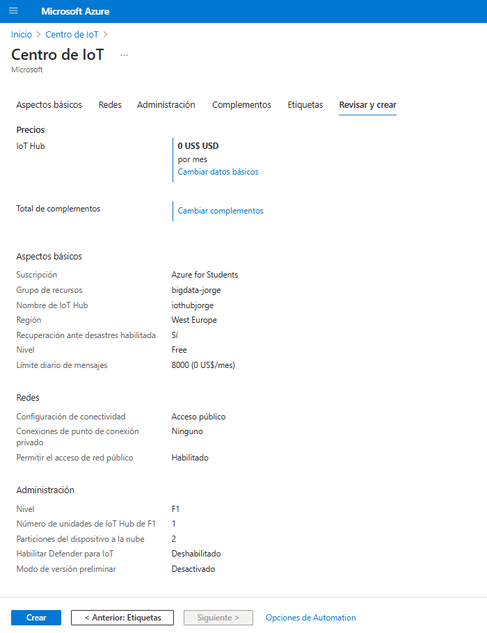

# Conectar Raspberry Pi a Azure IoT
## Objetivo
Vamos a conectar dispositivos a la nube sin ningún problema con Azure Centro IoT utilizando un simulador de Raspberry Pi.  

**¿Qué vamos a hacer?**  

- [x] Crear un Centro IoT.  
- [x] Registrar un nuevo dispositivo en el Centro IoT para conectarlo con la Raspberry Pi.  
- [x] Configurar el simulador Raspberry Pi.  
- [x] Ejecutar una aplicación de ejemplo en el simulador para enviar datos de un sensor al Centro IoT.  
- [x] Recopilar datos del sensor al ejecutar el simulador IoT.  
- [x] Conectar con una cuenta de almacenamiento (*Storage Account*), aplicaciones lógicas y envío de correos.  

La práctica 1 se dividide en 3 partes:
- **P1.1.** Conectar Raspberry Pi a Azure Centro IoT

- **P1.2.** Conectar Raspberry Pi a Azure Centro IoT y Enrutamiento a una Cuenta de Almacenamiento (Storage Account)

- **P1.3.** Conectar Raspberry Pi a Azure Centro IoT y Enrutamiento a una Aplicación Lógica y envío de correos

## P1.1. Conectar Raspberry Pi a Azure Centro IoT
### Introducción
- [x] Crearemos un "Azure Centro IoT".  
- [x] Registraremos un dispositivo para Raspberry Pi en Azure Centro IoT.  
- [x] Configuraremos el simulador Raspberry Pi.  
- [x] Ejecutaremos una aplicación de ejemplo en la Raspberry Pi para enviar datos del sensor al Centro IoT Hub.  
### Crear centro IoT
-       Creamos un nuevo recurso ****Centro de IoT****.

-       Como no tenemos un recurso creado, vamos a generarlo para asignar todo a este recurso y así después encontrarlo más fácilmente.  

-       Rellenamos los campos: *Suscripción, Grupo de recursos, nombre de la instancia, región y Nivel*. Después seleccionamos “**Siguiente: Redes**”.  

-       Seleccionamos “*Acceso público*”.  

-       Seleccionamos “**Siguiente: Administración**”. Lo dejamos por defecto. No tocamos ningún parámetro.  

-       Seleccionamos “**Siguiente: Etiquetas**”. No introducimos nada. O, si deseas etiquetar el recurso, introduce el Nombre / Valor para luego buscar el recurso a través de la etiqueta.  
-       Seleccionamos “**Siguiente: Revisar y crear**”. Revisamos que todo esté correcto.  
-       Llegados a este punto, ya podemos crear el recurso Centro de IoT. Hacemos clic en “**Create/Crear**”. Tardará un tiempo en implementarse el recurso. Mientras tanto, en el espacio de notificaciones podemos observar el progreso hasta que finalice.  

### Nuevo dispositivo IoT
-       En el menú de navegación del Centro de IoT, seleccionamos “**Dispositivos**” y luego seleccionamos “**Agregar dispositivo**”.  

-       En “**Crear un dispositivo**”, proporcionamos un nombre para el nuevo dispositivo, como por ejemplo: “*RaspberryInput*” y no es necesario modificar ningún otro parámetro.*Dejamos activada la opción “**Generar claves automáticamente**” para las claves primarias y secundarias, que se generan de forma automática.* Seleccionamos “**Guardar**”. Esta acción crea una nueva identidad del dispositivo para el Centro de IoT.

-       Después de crear el dispositivo, lo abrimos desde la lista del panel de *Dispositivos*.  

-       Copiamos la “**Cadena de conexión principal o String**” (*el código del dispositivo utiliza esta cadena de conexión para comunicarse con el Centro IoT*).  

!!! note "Nota" De forma predeterminada, las claves y las cadenas de conexión están enmascaradas porque son información confidencial. Si se hace clic en el ícono del ojo, se muestran. No es necesario mostrarlas para copiarlas.  

### Simulador

- Enlace: [Raspberry Pi Azure IoT Web Simulator](https://azure-samples.github.io/raspberry-pi-web-simulator/#GetStarted)

Hay tres áreas en este simulador:  

- **Circuito**: El circuito predeterminado consiste en una Raspberry Pi conectada a un sensor BME280 y un LED. No se puede modificar.  

 - **Área de codificación**: Un editor de código en línea para programar con Raspberry Pi. La aplicación de ejemplo predeterminada permite recopilar datos del sensor BME280 y enviarlos a Azure IoT Hub. La aplicación es totalmente compatible con dispositivos reales. 

- **Ventana de consola integrada**: Muestra la salida del código. En la parte superior aparecen tres botones:  
        - **Run (Ejecutar)**: Ejecuta la aplicación en el área de codificación.  
        - **Reset (Restablecer)**: Restablece el área de codificación a la aplicación de ejemplo predeterminada.  
        - **Fold/Expand (Comprimir/Expandir)**: A la derecha hay un botón para plegar o expandir la ventana de la consola.  

### Ejecución en simulador
-       Sobre el código por defecto del simulador web, **modificamos** la linia 15 dónde pone "*Your IoT hub device connection string*" para la cadena de conexión que hemos generado en Azure IoT Hub antes.

-       Seleccionar "**Ejecutar**" o escribir "**npm start**" para ejecutar.
Debemos de revisar el resultado del sensor y los mensajes generados.

## P1.2. Conectar Raspberry Pi a Azure Centro IoT y Enrutamiento a una Cuenta de Almacenamiento (Storage Account)
## P1.3. Conectar Raspberry Pi a Azure Centro IoT y Enrutamiento a una Aplicación Lógica y envío de correos

