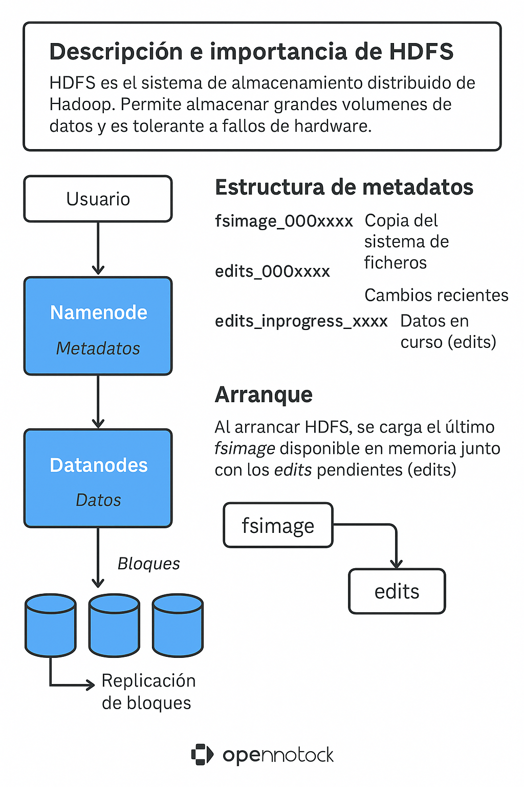

# HDFS

Claro, te voy a detallar HDFS (Hadoop Distributed File System) de forma **técnica** y también con un enfoque **formativo** para que te sirva para tus prácticas y para ampliar el entendimiento.

---

## 1. ¿Qué es HDFS?

**HDFS (Hadoop Distributed File System)** es el sistema de archivos distribuido que forma el corazón del ecosistema Hadoop. Su objetivo es:

* Almacenar enormes cantidades de datos (terabytes/petabytes).
* Ser tolerante a fallos (los datos no se pierden aunque fallen partes del hardware).
* Escalar fácilmente añadiendo más nodos.
* Ser eficiente en el acceso secuencial de grandes ficheros.

---

## 2. Arquitectura de HDFS

### Componentes Clave

* **Namenode (Maestro)**

  * Guarda *metadatos* del sistema de archivos.
  * Ejemplo de metadatos: estructura de directorios, permisos, asignación de bloques.
  * No almacena datos reales, solo la “tabla de contenidos” de dónde está todo.
  * Al arrancar, el Namenode carga:

    * El último **Fsimage**.
    * Aplica los cambios guardados en los **Edits** para reconstruir el estado actual.
* **Datanodes (Esclavos)**

  * Son los nodos que almacenan los datos reales en bloques.
  * Cada bloque por defecto tiene **3 réplicas** distribuidas en nodos distintos para tolerancia a fallos.
  * Reportan al Namenode su estado y la localización de los bloques.

### Datos y Replicación

* HDFS divide los ficheros grandes en bloques (por defecto 128 MB o 256 MB).
* Cada bloque se replica por defecto **3 veces** (pero es configurable).
* Esto permite que si un nodo falla, los datos sigan disponibles en otras réplicas.

---

## 3. Funcionamiento Interno (Metadatos y Recuperación)

### Ficheros Clave del Namenode

* **fsimage\_000xxxx**:

  * Es una *foto completa* del sistema de archivos en un momento específico.
  * Piensa en él como un *snapshot*.

* **edits\_000xxxx**:

  * Registra *todas las operaciones* recientes (crear fichero, borrar, renombrar, etc.).
  * Se va llenando con cada cambio que se realiza en HDFS.

* **edits\_inprogress\_xxxx**:

  * Es el archivo de *registro activo* donde se están escribiendo los cambios en tiempo real.

### Arranque del Namenode

Cuando ejecutas `start-dfs.sh`:

1. El Namenode carga en memoria la última copia estable de **fsimage**.
2. Aplica todos los cambios no procesados que están en los ficheros **edits**.
3. Así reconstruye el estado actual del sistema de ficheros.

### Secondary Namenode (¡No es un respaldo!)

* Su tarea principal es consolidar los edits con el fsimage para evitar que los ficheros **edits** crezcan sin control.
* Cada cierto tiempo (por defecto cada hora o cada 128MB de edits):

  1. Toma el fsimage y aplica los edits.
  2. Genera un nuevo fsimage actualizado.
  3. Reinicia los edits.

⚠️ **Importante**: El Secondary Namenode no es un respaldo del Namenode, solo ayuda a mantener limpios los metadatos.

---

## 4. Modos de Instalación

### Pseudodistribuido

* Todos los servicios (Namenode, Datanode) corren en una sola máquina pero como procesos separados.

### Distribuido

* Servicios distribuidos en múltiples nodos reales.
* Para producción y grandes volúmenes de datos.

---

## 5. Prácticas recomendadas

| Práctica       | Qué Aprenderás                                                             |
| -------------- | -------------------------------------------------------------------------- |
| **Práctica 3** | Instalación y configuración de HDFS en modo pseudodistribuido.             |
| **Práctica 4** | Cómo se manejan internamente los ficheros **fsimage** y **edits**.         |
| **Práctica 5** | Operaciones con ficheros en HDFS (`hdfs dfs -put`, `-get`, `-ls`).         |
| **Práctica 6** | Administración: balanceo, chequeo de bloques (`fsck`), gestión de espacio. |
| **Práctica 7** | Uso de **snapshots** para proteger y versionar datos en HDFS.              |

---

## 6. Detalle técnico: Cómo evitar la corrupción de metadatos

* Nunca toques manualmente los ficheros **fsimage** y **edits**.
* Usa siempre las herramientas de HDFS para operaciones administrativas.
* Mantén monitoreado el espacio del Namenode (si se llena, HDFS puede fallar).

---

## 7. Resumen Visual (Simplificado)

```
[Usuario]
   |
   v
[Namenode]  <--- Metadatos (fsimage + edits)
   |
   v
[Datanodes] <--- Datos reales (bloques replicados)
```

<div align="center">

</div>
