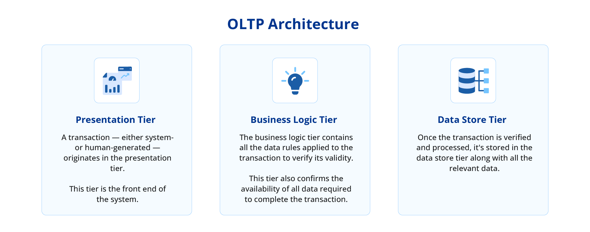
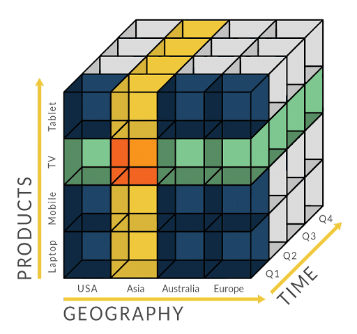
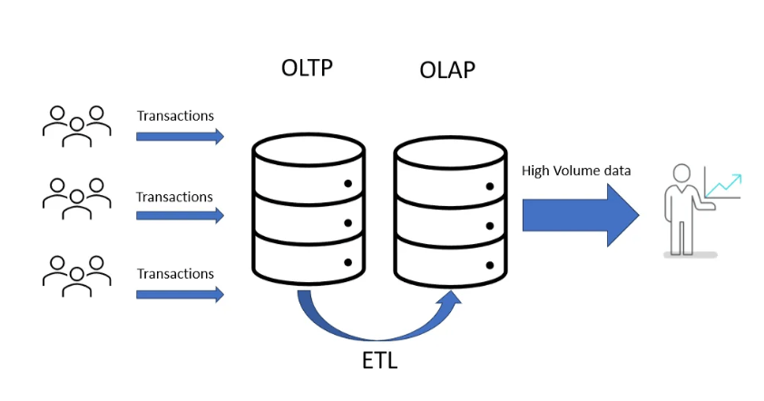

# Introducción Bussines Intelligence (BI)

Para entender el mundo del BI, hay que llegar a conocer cuáles son los sistemas de bases de datos más importantes
y sus características. Por eso, vamos a revisar los sistemas operacionales, transaccionales y noSQL.

## Sistema operacional (OLTP)

Generalmente, la información que se quiere investigar sobre un cierto dominio de la organización se encuentra en bases de datos y otras fuentes muy diversas, tanto internas como externas.

- [x] Muchas de estas fuentes son las que se utilizan para el trabajo transaccional diario (conocido como OLTP, On-Line Transactional Processing).

- [x] Sobre estas mismas bases de datos de trabajo ya se puede extraer conocimiento (visión tradicional).

Problemas para realizar el análisis en este sistema (OLTP):

-  La información se encuentra en varias y heterogéneas bases de datos y, en consecuencia, no se puede explotar en conjunto.

-  Solo es posible el análisis de los datos actuales, no mantiene valores históricos para tratar evolutivos.

-  Se obstaculiza el trabajo transaccional diario de los sistemas de información originales, no permite el análisis on-line.

-  La base de datos está diseñada para el trabajo transaccional, no para el análisis de los datos.

## Sistema analítico (OLAP)

Disponer de una base de datos que permita extraer conocimiento de la información histórica almacenada en la organización.

Objetivos:

- [x] Análisis de la organización

- [x] Previsiones de evolución

- [x] Diseño de estrategias

Algunas características:

-  Almacén de datos para el análisis y toma de decisiones.

-  Permite realizar análisis on-line, por lo que aumenta el poder de toma de decisiones por parte de los responsables en cuestión

-  Unifica información dispersa de diversos sistemas operacionales

-  Contiene la información relevante de la organización

-  Diseños orientados a conceptos de negocio manejados por el usuario

-  Sistema OLAP (On-Line Analitical Procesing)

## Sistema NoSQL

Se refiere a un conjunto de sistemas de gestión de bases de datos que **no siguen estrictamente el modelo relacional** (tablas con filas y columnas). Fueron creadas para manejar grandes volúmenes de datos, de forma rápida, flexible y escalable, algo que a veces las bases de datos SQL tradicionales no logran con la misma eficiencia.

Algunas características:

-  No usan tablas fijas como en SQL (pueden ser documentos, grafos, pares clave-valor, etc.).

-  Escalabilidad horizontal → se pueden repartir los datos en muchos servidores (clústeres) fácilmente.

-  Alta velocidad de lectura y escritura, útil para apps en tiempo real (redes sociales, e-commerce, videojuegos online).

-  Estructura flexible → permiten trabajar con datos semi-estructurados (JSON, XML) o sin esquema definido.

-  Consistencia eventual → en muchos casos priorizan la disponibilidad y la velocidad sobre la consistencia estricta (a diferencia de SQL, que es muy rígido con transacciones).

## OLTP vs OLAP vs NoSQL

| **Característica**                | **Operacional (OLTP)**                          | **Datawarehouse (OLAP)**                                             | **NoSQL**                                                                 |
|-----------------------------------|------------------------------------------------|-----------------------------------------------------------------------|----------------------------------------------------------------------------|
| **Tipo de datos**                 | Almacén de datos actuales                       | Almacén de datos históricos                                           | Datos flexibles: documentos, clave-valor, grafos, columnas distribuidas    |
| **Nivel de detalle**              | Almacena datos al detalle                       | Almacena datos al detalle y agregados a distintos niveles             | Puede almacenar datos al detalle o agregados, sin esquema fijo             |
| **Tamaño de la base de datos**    | Bases de datos medianas                         | Bases de datos grandes                                                | Bases de datos muy grandes y distribuidas                                  |
| **Naturaleza de los datos**       | Los datos son actuales                          | Los datos son estáticos                                               | Los datos son semi-estructurados, dinámicos o no estructurados             |
| **Tipo de procesos**              | Los procesos son repetitivos                    | Los procesos no son previsibles                                       | Procesos distribuidos, consultas flexibles y adaptables                    |
| **Tiempo de respuesta**           | Tiempo de respuesta pequeño                     | Tiempo de respuesta variable                                          | Alta velocidad de lectura/escritura, escalable horizontalmente             |
| **Tipo de decisiones que soporta**| Soporta decisiones diarias                      | Soporta decisiones estratégicas                                       | Soporta decisiones operativas y en tiempo real (apps web, IoT, Big Data)   |
                                    |

## Componentes de un sistema BI

---

### Sistema ETL

En un sistema ETL, las fases esenciales son las siguientes:

-   **Extracción**: elaboración de interfaces entre sistemas operacionales orígenes de datos

-   **Transformación**: validación de los datos extraídos, transformándolos al formato deseado

-   **Carga**: cargar físicamente los datos extraídos de los sistemas operacionales y ya transformados en el modelo de datos del Datawarehouse

---

### Datawarehouse
Se soporta sobre el modelo físico dimensional diferente de los sistemas de bases de datos que están basados en el modelo Entidad-Relación (E/R). Este modelo contiene la misma información que el modelo E/R pero agrupa los datos con el objetivo de ganar una mayor comprensión para el usuario y garantizar la ejecución rápida y eficiente de las consultas.

Existen dos tecnologías para implementar dicho modelo:

- [x] MultidimensionalOLAP (MOLAP): se indexa los datos directamente en un modelo multidimensional (cubos) en el cual todas las posibles combinaciones de los datos ya están calculadas en una celda

- [x] RelationalOLAP (ROLAP): implementa las estructuras dimensionales mediante bases de datos con modelos relacionales. 

---

### Presentación

En la capa de presentación de los datos, puede tener diferentes enfoques.

**DSS (Decisión Support System)**:
Informes dinámicos, normalmente para representar un indicador o un grupo de indicadores relacionados funcionalmente en tablas de datos.
Además de estos informes predefinidos, los usuarios con capacidades de análisis podrán crear sus propios informes y obtener respuestas en demandas de información puntuales.

**EIS (Executive Information System)**:
Informes estáticos, predefinidos, fáciles de manejar y orientados a los directores. Son informes muy visuales (normalmente se utilizan exclusivamente gráficos) y con un nivel alto de agregación de la información. Deben estar orientados a la gestión estratégica.

**BSC (Balance Scored Card)**:
Informes estáticos para la gestión estratégica de la empresa. Permite medir el rendimiento de áreas o personas mediante el análisis de diversos de un conjunto de indicadores con valores objetivo y pesos.

## Modelo lógico

Existe un modelo lógico a definir que representa el análisis de los datos y que no tiene el por qué ser igual que el modelo físico de la base de datos.

**Ejemplo**

**Organización**: Cadena de supermercados.

**Actividad objeto de análisis**: ventas de productos.
Información registrada sobre una venta:
“del producto“X” se han vendido en el almacén“nro.1” el día 17/2/2008, 5 unidadespor un importede 100 euros.”

---

## Modelo multidimensional
En un esquema multidimensional se representa una actividad que es objeto de análisis (hecho) y las dimensiones que caracterizan la actividad (dimensiones).

- [x] La información relevante sobre el hecho (actividad) se representa por un conjunto de indicadores.

- [x] La información descriptiva de cada dimensión se representa por un conjunto de atributos (atributos de dimensión).

## Business Intelligence (BI)

Business Intelligence suele definirse como la transformación de los datos de la compañía en conocimiento para obtener una ventaja competitiva.
Desde un punto de vista más pragmático, y asociándolo directamente a las tecnologías de la información, podemos definir Business Intelligence como:

El conjunto de metodologías, aplicaciones y tecnologías que permiten reunir, depurar y transformar datos de los sistemas transaccionales e información desestructurada (interna y externa a la compañía) en información estructurada, para su explotación directa (reporting, análisis OLAP...) o para su análisis y conversión en conocimiento soporte a la toma de decisiones sobre el negocio.

## Características de un en entorno Big Data frente entornos BI
Aunque el proceso ETL se puede realizar con distintas herramientas, en entornos de **Big Data** se requieren capacidades especiales para manejar la complejidad y volumen de datos:

- **Flexibilidad en los formatos**: debe poder procesar datos estructurados, semiestructurados y no estructurados.
- **Escalabilidad y tolerancia a fallos**: el sistema debe crecer según la demanda y continuar funcionando, aunque haya errores.
- **Conectores para múltiples fuentes de datos**: integración con diferentes sistemas y tecnologías.

---

## Terminología

| **Concepto**         | **Descripción**                                                                 |
|-----------------------|---------------------------------------------------------------------------------|
| **Hecho**             | Un hecho es un elemento de información del negocio, es decir, algo que se puede medir. |
| **Indicador**         | Fórmula matemática aplicada a un conjunto de hechos.                           |
| **Dimensión / Eje de análisis** | Aspecto o perspectiva mediante la cual se puede acceder y analizar los hechos. |
| **Atributo**          | Característica específica de una dimensión.                                    |
| **Jerarquía**         | Relación padre/hijo utilizada para agrupar los atributos de una dimensión.     |
| **Agregación**        | Método por el cual los datos son agrupados para crear una tabla de hechos específica. |
| **Sumarización**      | Método por el cual los datos se cambian a un nivel diferente de granularidad.  |
| **Desnormalización**  | Proceso de introducir redundancias en la información de las tablas de la base de datos para mejorar el rendimiento de la aplicación. |
| **Datamart**          | Subconjunto departamental de un Datawarehouse corporativo o almacén de datos enfocado en un área específica, utilizado para el análisis y la toma de decisiones. |
| **Drill Down / Up**   | Navegar dentro de la información, desde niveles más altos a niveles más bajos o viceversa. |
| **DataMining**        | Búsqueda de patrones de comportamiento dentro de los datos, ya sea en un Datawarehouse o cualquier otra fuente de información. |

## Herramientas

### 🧠 Herramientas de BI
Estas herramientas permiten **analizar, visualizar y presentar datos** para apoyar la **toma de decisiones estratégicas y operativas**.

- **Tableau** – Visualización de datos interactiva y potente, ideal para análisis avanzados.  
- **Power BI** – Plataforma de Microsoft para reportes y dashboards.  
- **Qlik Sense / QlikView** – BI asociativo para exploración y análisis de datos.  
- **Looker (Google)** – BI en la nube, enfocado en análisis colaborativo.  
- **MicroStrategy** – Plataforma empresarial de análisis y visualización.  
- **SAP BusinessObjects** – BI empresarial con integración en SAP.  
- **IBM Cognos Analytics** – BI con capacidades avanzadas de reportes y analítica.  
- **Metabase** – BI open source, sencilla y colaborativa.  
- **Redash** – Open source para visualización y consultas SQL.  
- **Elasticsearch (con Kibana)** – Motor de búsqueda y analítica en tiempo real, ideal para dashboards y monitoreo.

---

### 🔄 Herramientas de ETL (Extract, Transform, Load)
Herramientas enfocadas en **integrar datos** desde diversas fuentes hacia **Data Warehouses** o **Data Lakes**, aplicando procesos de **extracción, transformación y carga**.

- **ODI (Oracle Data Integrator)** – Solución empresarial de Oracle para procesos ETL robustos y escalables.  
- **Talend** – Plataforma completa para integración y calidad de datos (Open Source y Enterprise).  
- **Informatica PowerCenter** – Plataforma empresarial líder en integración de datos.  
- **Pentaho Data Integration (PDI)** – Herramienta ETL open source muy popular.  
- **Apache NiFi** – ETL para **flujos de datos en tiempo real** y por lotes, con interfaz visual.  
- **Microsoft SQL Server Integration Services (SSIS)** – ETL integrado con el ecosistema Microsoft.  
- **AWS Glue** – ETL serverless administrado por Amazon Web Services.  
- **Azure Data Factory** – ETL en la nube dentro del ecosistema Azure.  
- **Google Cloud Dataflow** – ETL basado en Apache Beam para Google Cloud.  
- **Apache Kafka (Streaming)** – Procesamiento y transporte de datos en tiempo real.  

---

### 🔍 Herramientas de búsqueda y analítica de datos
Estas herramientas se enfocan en **indexación**, **búsqueda** y **análisis avanzado de datos**.

- **Elasticsearch** – Motor de búsqueda y analítica distribuido, ideal para grandes volúmenes de datos.  
- **Kibana** – Interfaz gráfica para visualización y monitoreo de datos indexados en Elasticsearch.  
- **Logstash** – Herramienta para ingesta, transformación y envío de datos hacia Elasticsearch.  

---

### 📌 Recomendaciones

- **BI empresarial:** Tableau, Power BI, Qlik.  
- **ETL empresarial:** ODI, Informatica PowerCenter, Talend.  
- **ETL Open Source:** Apache NiFi, Pentaho, Airbyte.  
- **Nube:** AWS Glue, Azure Data Factory, Google Dataflow.  
- **Analítica y búsqueda:** Elasticsearch + Kibana + Logstash (ELK Stack).  