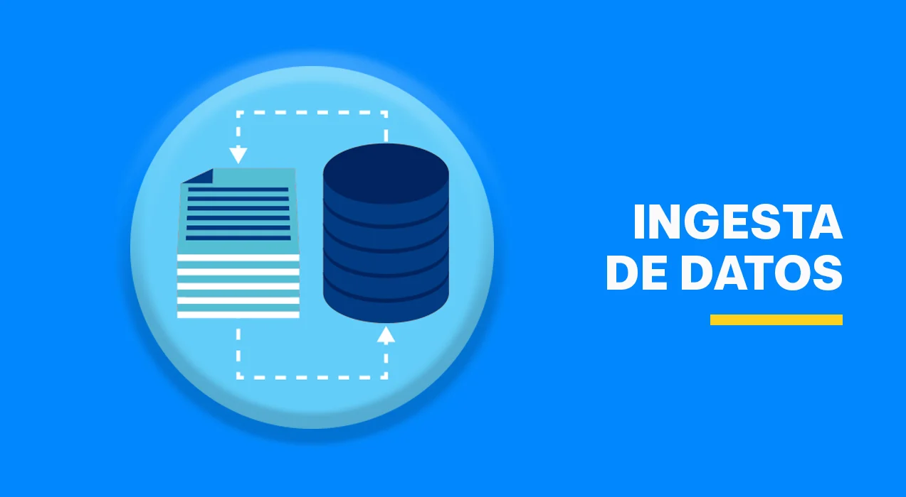
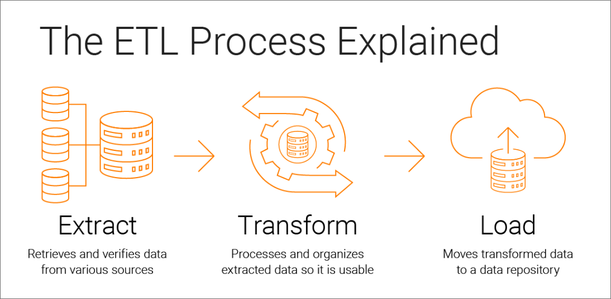
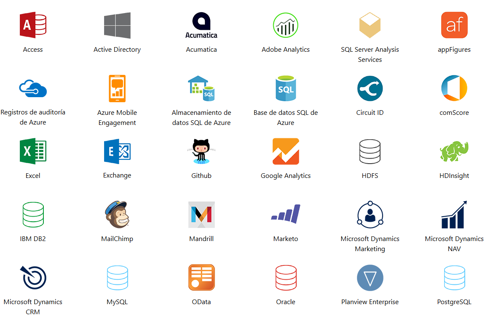
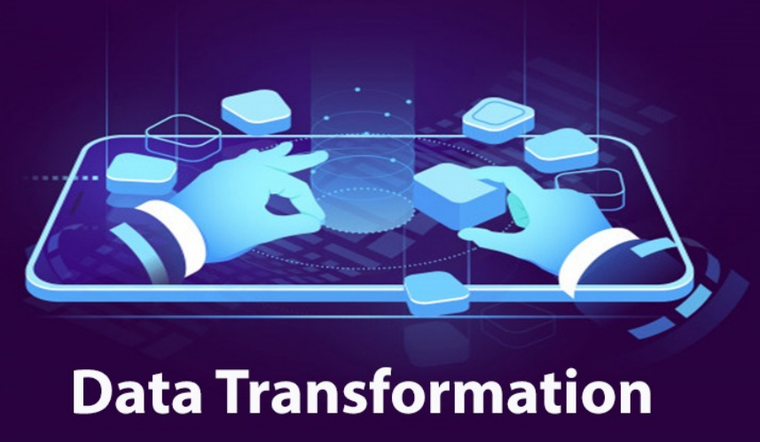
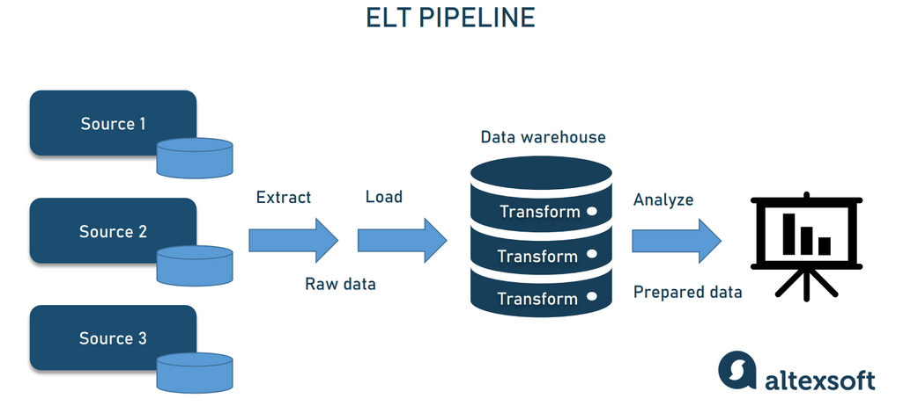
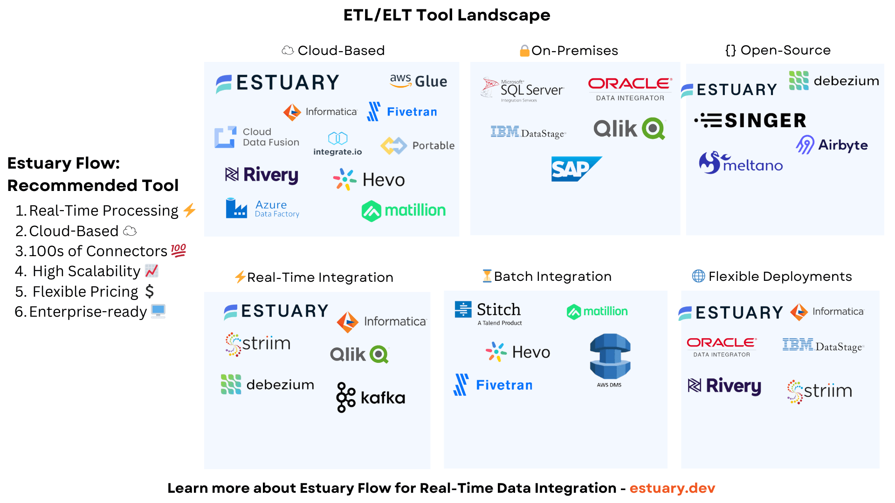

# Introducción a ETL

## Ingesta de datos

La **ingesta de datos** es el proceso de **obtener, guardar y procesar datos** provenientes de diferentes fuentes.  
Este proceso se puede realizar en cualquier lenguaje de programación y en distintos sistemas, pero cuando trabajamos en **entornos de Big Data**, comienzan a aparecer retos importantes relacionados con el volumen, la variedad y la velocidad de los datos.

---

### Obtención y almacenamiento de datos
La ingesta implica trabajar con datos que pueden provenir de diversas fuentes, estructuras y características.  
Algunos ejemplos incluyen:

- **Fuentes distintas**: bases de datos, APIs, sensores IoT, archivos planos, etc.  
- **Estructuras diferentes**: datos estructurados, semi-estructurados y no estructurados.  
- **Características variadas**: distintos formatos, velocidades de llegada, calidades y tamaños.

> **Nota:**  
> No se puede improvisar cada vez que llega un nuevo dato.  
> Es necesario diseñar y construir una **pipeline de ingesta**, que permita un proceso automatizado y escalable.

---

### Pipeline de datos
Una **pipeline de ingesta** es un flujo estructurado que define los pasos y tecnologías necesarios para **procesar, mover y almacenar datos** de forma eficiente.

Características clave:
- Dividida en **fases** con objetivos claros.  
- Define una **secuencia de tecnologías** para cada etapa.  
- Considera el rendimiento:  
  - Los datos no se analizan en el sistema donde se generan.  
  - Uso diferenciado de **sistemas OLTP** y **OLAP**:  
    - **OLTP** (*Online Transaction Processing*): orientado a la gestión y actualización rápida de datos transaccionales.  
    - **OLAP** (*Online Analytical Processing*): orientado al análisis de grandes volúmenes de datos para la toma de decisiones.

---

### Tipos de soluciones y consideraciones
Existen múltiples herramientas y soluciones, tanto **libres** como **comerciales**, para implementar pipelines de ingesta.  
Al elegirlas, se deben tener en cuenta factores como:

- **Procesamiento Batch vs Stream**  
  - *Batch*: procesamiento en lotes, datos acumulados y procesados en intervalos.  
  - *Stream*: procesamiento en tiempo real o cercano al tiempo real.

- **Escalabilidad**  
  - Pensar en si se trabajará con **pocos datos** o con **grandes volúmenes** (Big Data).

- **Rendimiento**  
  - Selección de tecnologías según la velocidad y eficiencia requerida.

- **Interfaz y usabilidad**  
  - Herramientas con **interfaz gráfica** vs **línea de comandos**.

- **Licenciamiento**  
  - **Software libre** vs **software propietario**.

- **Integración**  
  - Uso de **herramientas individuales** o una **suite integrada**.

- **Infraestructura**  
  - Procesamiento **local** vs **en la nube**.

---

### Resumen
La ingesta de datos es un paso crítico en cualquier arquitectura de datos.  
Para manejar la complejidad de entornos de Big Data, se debe:

1. Diseñar una pipeline robusta y escalable.  
2. Seleccionar las herramientas adecuadas considerando factores como el volumen, la velocidad y la variedad de los datos.  
3. Distinguir entre procesamiento **transaccional (OLTP)** y **analítico (OLAP)**.  
4. Evaluar opciones de infraestructura, licenciamiento y escalabilidad.

## Extracción, Transformación y Carga (ETL)

La **ETL (Extracción, Transformación y Carga)** es un proceso fundamental en la ingeniería de datos y constituye un **tipo específico de pipeline**.  
Su objetivo es **obtener datos de diversas fuentes**, transformarlos para adaptarlos a las necesidades de análisis y finalmente **cargarlos** en un sistema de destino, como un **Data Warehouse** o un **Data Lake**.

---

### Orígenes de datos

Las fuentes de datos pueden ser muy variadas, lo que aumenta la complejidad del proceso de extracción. Algunos ejemplos incluyen:

- Archivos **Excel (XLS, XLSX)**
- Documentos **PDF**
- Archivos de texto **TXT**
- Archivos **CSV**
- **Bases de datos relacionales** (SQL)
- **Bases de datos no relacionales** (NoSQL)
- Archivos **JSON**
- **Mensajes en redes sociales**, como Twitter

---

### Buenas prácticas en la extracción
Durante la fase de extracción, es fundamental seguir ciertos principios para evitar problemas y asegurar la calidad de los datos:

- **Verificar la calidad y el formato** de los datos antes de procesarlos.
- La extracción debe ser **rápida y ligera**, sin afectar el rendimiento del sistema origen.
- **No poner en riesgo la fuente de datos**, evitando bloqueos, caídas o pérdida de información.

---

### Fase de Transformación

En esta etapa se procesan los datos para prepararlos para el análisis.  
Algunas tareas comunes incluyen:

- **Cambios de codificación** para unificar formatos.
- **Eliminación de datos duplicados**.
- **Cruzar y relacionar diferentes fuentes de datos**.
- **Agregación de información** para obtener resúmenes y métricas.
- **Filtrar y seleccionar partes de los datos** relevantes.
- **Creación de códigos, claves o identificadores únicos**.
- **Generación de información nueva** a partir de la existente.
- **Estructuración de los datos** para cumplir con modelos analíticos.
- **Generación de indicadores clave (KPIs)**.
- **Normalización** para mantener consistencia y calidad.

---

### Fase de Carga
La etapa final de una ETL es la **carga de los datos transformados** en el sistema de destino, que puede ser:

- Un **Data Warehouse** para análisis estructurado.  
- Una **base de datos** para consumo operativo o aplicaciones.  

#### Requisitos clave en la carga:
- **Mínimo tiempo de transacción**, para evitar cuellos de botella.
- Cada sistema puede requerir un tipo de carga diferente:
  - **Bases de datos SQL**.
  - **Archivos planos** como CSV o TXT.
  - **Cargadores específicos** para herramientas propietarias.

#### Aspectos a considerar:
- **Gestión de índices** para optimizar la consulta de datos.
- **Gestión de claves de distribución y particionamiento**, especialmente en sistemas distribuidos.
- **Tamaño de las transacciones y commits**, asegurando la eficiencia y la integridad de los datos.

---

### Flujo general de una ETL

1. **Extracción (Extract)**  
   - Captura de datos desde diferentes fuentes.  
   - Debe ser rápida, eficiente y sin afectar el rendimiento del sistema original.

2. **Transformación (Transform)**  
   - Limpieza, validación y enriquecimiento de los datos.  
   - Incluye normalización, estandarización y generación de nueva información útil para el análisis.

3. **Carga (Load)**  
   - Inserción de los datos procesados en el sistema de destino.  
   - Optimización para consultas rápidas y seguras.

---

### Resumen
El proceso ETL permite que las organizaciones dispongan de datos:

- **Confiables y de calidad**.  
- **Procesados eficientemente**, listos para análisis avanzado.  
- **Disponibles sin comprometer el rendimiento** ni la seguridad de los sistemas de origen.

> Una ETL bien diseñada es la base para cualquier estrategia de **analítica de datos** o **Big Data**, asegurando que la información llegue en el formato y momento adecuado para la toma de decisiones.

## Soluciones comerciales ETL

Existen diversas herramientas comerciales especializadas en **procesos ETL** que facilitan la **extracción, transformación y carga de datos**.  
Estas soluciones suelen ofrecer interfaces visuales, conectores listos para usar y funcionalidades avanzadas de integración, escalabilidad y seguridad.

---

### Características comunes
Las herramientas comerciales suelen incluir:

- **Interfaces gráficas intuitivas** para diseñar y gestionar pipelines.
- **Gran variedad de conectores nativos** para distintas fuentes y destinos de datos.
- **Escalabilidad** para manejar grandes volúmenes de información en entornos Big Data.
- **Soporte técnico y actualizaciones** garantizadas por el proveedor.
- **Módulos avanzados** para:
  - Automatización de flujos.
  - Monitorización en tiempo real.
  - Gestión de errores y tolerancia a fallos.
- **Seguridad y cumplimiento normativo**, incluyendo cifrado y gestión de accesos.

---

### Ejemplos (no open source)

A continuación, se presentan algunas de las herramientas más utilizadas en la industria:

#### 1. **Informatica PowerCenter**
- Plataforma líder en integración de datos empresariales.
- Conectores para una amplia variedad de sistemas, bases de datos y servicios en la nube.
- Enfoque en **escalabilidad**, **alta disponibilidad** y **seguridad**.
- Adecuada para entornos corporativos con gran volumen de datos.

---

#### 2. **Talend Data Fabric**
- Solución comercial basada en la tecnología de Talend, con versiones de pago y funcionalidades avanzadas.
- Amplia biblioteca de conectores para sistemas cloud y on-premise.
- Soporte para **procesamiento batch** y **streaming**.
- Integración con herramientas de **gobernanza y calidad de datos**.

---

#### 3. **Microsoft SQL Server Integration Services (SSIS)**
- Herramienta incluida en **Microsoft SQL Server**.
- Ideal para empresas que ya trabajan en el ecosistema Microsoft.
- Ofrece:
  - Diseño visual de ETL.
  - Transformaciones predefinidas.
  - Integración directa con **Azure** y servicios cloud de Microsoft.

---

#### 4. **Oracle Data Integrator (ODI)**
- Enfocado en entornos corporativos que utilizan soluciones Oracle.
- Compatible con múltiples bases de datos y tecnologías.
- Permite **procesamiento masivo** con alto rendimiento.
- Integración con otros productos de Oracle como **Oracle Cloud Infrastructure**.

---

#### 5. **IBM DataStage**
- Parte de la suite **IBM InfoSphere**.
- Especializado en entornos empresariales complejos.
- Destacado por:
  - **Alta capacidad de paralelización**.
  - Gestión avanzada de metadatos.
  - Compatibilidad con soluciones de Big Data y cloud.

---

#### 6. **AWS Glue**
- Servicio ETL totalmente gestionado en la nube de **Amazon Web Services (AWS)**.
- No requiere infraestructura local.
- Compatible con múltiples formatos de datos y servicios cloud.
- Ideal para **Data Lakes** y entornos **serverless**.

---

### Comparativa general

| Herramienta        | Tipo        | Entorno principal       | Puntos fuertes                          |
|--------------------|------------|--------------------------|-----------------------------------------|
| Informatica PowerCenter | Comercial  | On-premise / Cloud híbrido | Estabilidad, escalabilidad, seguridad.  |
| Talend Data Fabric | Comercial  | Cloud y local            | Flexibilidad, conectores, gobernanza.   |
| SSIS (Microsoft)   | Comercial  | Ecosistema Microsoft     | Integración con SQL Server y Azure.     |
| Oracle Data Integrator | Comercial | Ecosistema Oracle        | Rendimiento y compatibilidad.           |
| IBM DataStage      | Comercial  | Empresas de gran escala  | Paralelización y Big Data.              |
| AWS Glue           | Comercial  | 100% Cloud (AWS)         | Sin servidores, escalabilidad nativa.   |

---

### Beneficios de usar soluciones comerciales
- **Ahorro de tiempo** gracias a herramientas preconfiguradas.
- **Reducción de errores** mediante interfaces visuales y validaciones integradas.
- **Soporte profesional** con actualizaciones continuas.
- **Integración nativa** con otros servicios empresariales y en la nube.
- **Escalabilidad** sin necesidad de diseñar toda la infraestructura desde cero.

---

### Conclusión
Las **soluciones comerciales ETL** son ideales para organizaciones que requieren:
- Alta **confiabilidad y disponibilidad**.
- **Soporte oficial** y actualizaciones regulares.
- Gestión eficiente de **grandes volúmenes de datos**.
- Integración con ecosistemas específicos como **AWS**, **Azure**, **Oracle** o **IBM**.

> La elección de la herramienta adecuada dependerá del presupuesto, la infraestructura existente y los objetivos estratégicos de la empresa.
