# Analítica de datos

## ¿Que es el Data Analytics?

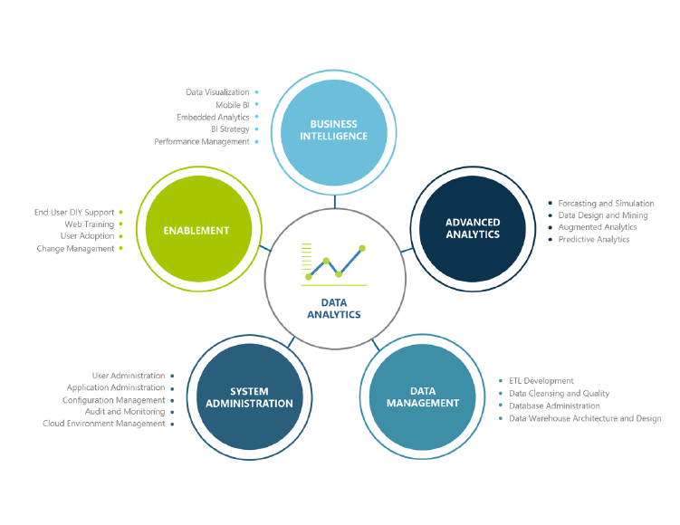

Gestión de los datos para todos los usos
(operacional y analítico) y el análisis de
datos para conducir los procesos
comerciales y mejorar los resultados a
través de toma de decisiones más eficaz
y basadas en la experiencia del cliente.

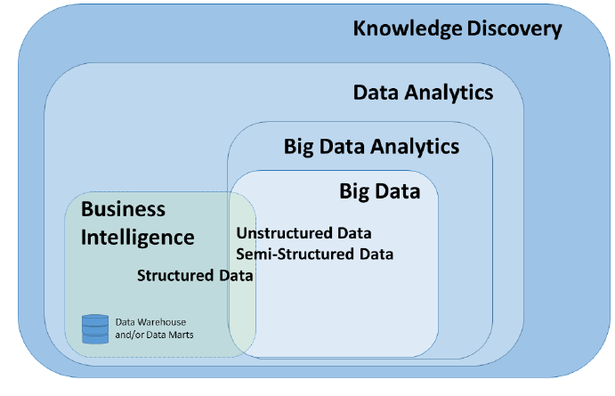

## Roles en Data Analytics

-   Data Analyst

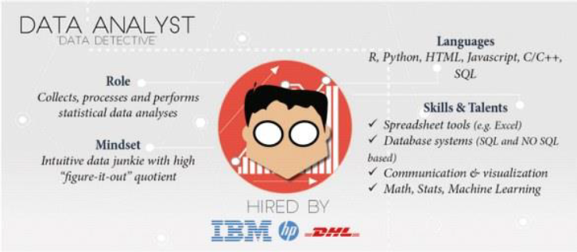

---

-   Data Engineer

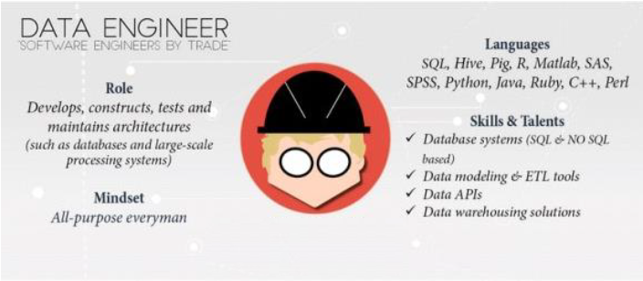

---

-   Data Scientist

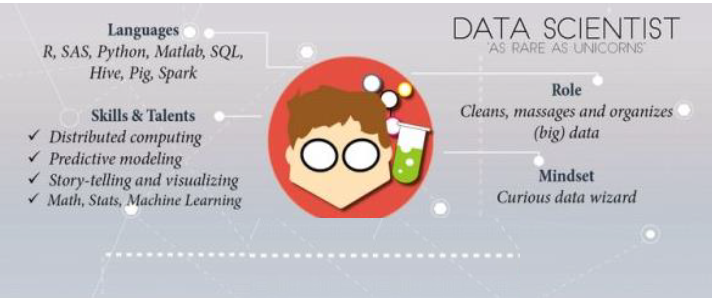

---

-   Data Architect

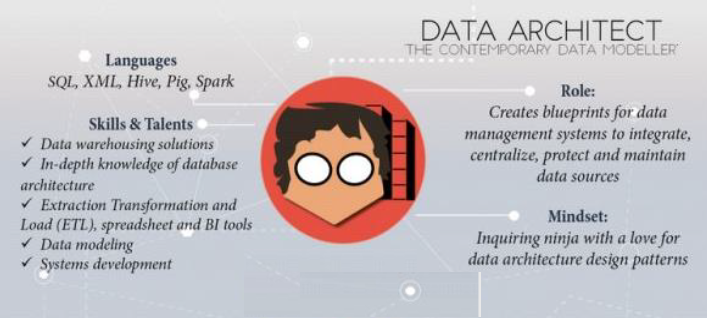

---

-   Business Analyst

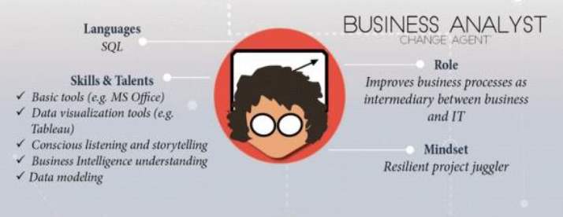

## ¿Que es el análisis de datos?

El proceso de identificar, limpiar, transformar y
modelar los datos para detectar información
significativa y útil. Después, los datos se
convierten en una historia a través de informes
para el análisis con el fin de admitir el proceso
crítico de toma de decisiones

## Metodologías

- Análisis Exploratorio de Datos (EDA) que pretende encontrar patrones y relaciones en los datos.

- Análisis Confirmatorio de Datos (CDA) aplica técnicas estadísticas para determinar si las hipótesis
sobre un conjunto de datos son verdaderas o falsas

## Tipos

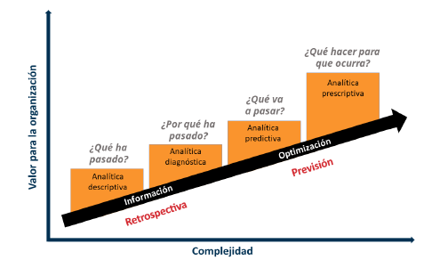

### Analítica descriptiva

El análisis descriptivo ayuda a responder
preguntas sobre lo **QUÉ HA SUCEDIDO**

-   Mediante el desarrollo de indicadores
clave de rendimiento (KPI), se puede
facilitar el seguimiento del éxito o el
fracaso de los objetivos clave.

-   Un ejemplo de análisis descriptivo es la
generación de informes para proporcionar
una visión de los datos financieros y de
ventas de una organización.

### Analítica diagnóstica

-   El análisis de diagnóstico ayuda a
responder preguntas sobre **POR QUÉ
SE HA PRODUCIDO** un evento.

-   Las técnicas de análisis de diagnóstico
complementan el análisis descriptivo
básico y usan los resultados del análisis
descriptivo para identificar la causa de
estos eventos.

### Analítica predictiva

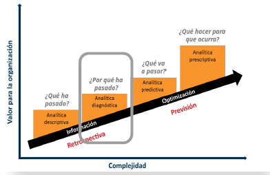

El análisis predictivo ayuda a responder
a preguntas sobre lo **QUÉ OCURRIRÁ EN
EL FUTURO**.

-   Las técnicas de análisis predictivo usan
datos históricos para identificar
tendencias y determinar la probabilidad
de que se repitan.

-   Engloban diversas técnicas estadísticas y
de aprendizaje automático, como las de
redes neuronales, árboles de decisión y
regresión.

### Analítica presctiptiva

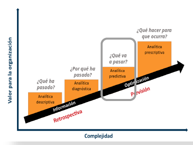

El análisis prescriptivo ayuda a
responder preguntas sobre las
**acciones que se deben llevar a cabo
para lograr un objetivo**.

-   Esta técnica permite que, en caso de
incertidumbre, las empresas tomen
decisiones fundamentadas.

-   Las técnicas de análisis prescriptivo
dependen de estrategias de
aprendizaje automático para buscar
patrones en conjuntos de datos de
gran tamaño.

-   Mediante el análisis de eventos y
decisiones anteriores, las
organizaciones pueden calcular la
probabilidad de otros resultados.

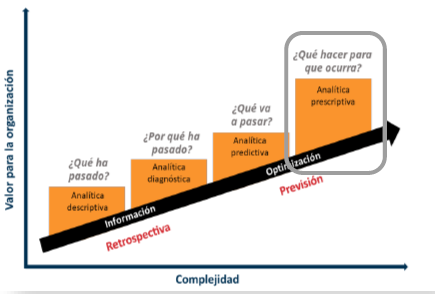

## Proceso de análisis de datos

1.  Preparación
2.  Modelado
3.  Visualización
4.  Análisis
5.  Administración

### 1. Preparación

La preparación de los datos ocupa gran parte del trabajo.

-   Los datos imprecisos o incorrectos pueden tener un gran impacto y generar informes no válidos, una pérdida de
confianza y un efecto negativo en las decisiones
empresariales

-   La preparación de datos es el proceso de generación de perfiles y de limpieza y transformación de los datos para prepararlos para el modelado y la visualización.

-   La preparación de datos consiste en:
○ garantizar la integridad de los datos,
○ corregir datos incorrectos o inexactos,
○ identificar los datos que falten,
○ convertir datos de una estructura o hacer que los datos sean más legibles.

-   Las garantías de privacidad y seguridad también son
importantes. Estas pueden incluir la amonificación de los datos para evitar que se compartan en exceso o impedir que los usuarios vean información de identificación personal cuando no es necesario.

### 2. Modelado

El modelado de datos es el proceso de determinar cómo se relacionan las tablas entre sí.
-   Este proceso se realiza mediante la definición y creación de relaciones entre las tablas.
-   A partir de ahí, puede mejorar el modelo si define métricas y agrega cálculos personalizados para enriquecer los datos.
-   Un modelo de datos eficaz hace que los informes sean más precisos, permite que los datos se exploren de manera
más rápida y eficaz, reduce la duración del proceso de creación de informes y simplifica el mantenimiento futuro del informe.
-   Un modelo mal diseñado puede tener un impacto negativo en la precisión general y el rendimiento del informe.
-   Por el contrario, un modelo bien diseñado con datos bien preparados garantizará un informe eficaz y de confianza.
-   El proceso de preparación y modelado de datos es iterativo. La preparación de datos es la primera tarea en el
análisis de datos. Comprender y preparar los datos antes de modelarlos hará que el paso de modelado sea mucho más fácil.

### 3. Visualización

En la tarea de visualización es donde se hace que los datos cobren vida. El objetivo final de la tarea de visualización es solucionar los
problemas de la empresa. Un informe bien diseñado debe contar una historia atractiva sobre esos datos, lo que permite a los responsables de la toma de decisiones empresariales obtener rápidamente las conclusiones que necesitan. 

-   Con las visualizaciones e interacciones adecuadas, puede proporcionar un
informe eficiente que guíe al lector a través del contenido de
forma rápida y eficaz, lo que le permitirá seguir una narrativa en
los datos.

-   Los informes que se crean durante la tarea de visualización
ayudan a las empresas y a los responsables de la toma de
decisiones a comprender el significado de los datos para que se
puedan tomar decisiones acertadas y precisas. Los informes
impulsan las acciones, las decisiones y los comportamientos
generales de una organización que confía y depende de la
información detectada en los datos.

-   La empresa puede comunicar que necesita todos los puntos de
datos de un informe concreto para la toma de decisiones. Como
analista de datos, debe dedicar tiempo a comprender por
completo el problema que la empresa intenta resolver. Determine
si todos los puntos de datos son necesarios, ya que un exceso de
datos puede dificultar la detección de los puntos clave. Una
historia de datos pequeña y concisa puede ayudar a encontrar la
información rápidamente.

### 4. Análisis

La tarea de análisis es el paso importante de entender e
interpretar la información que se muestra en el informe.

-   El análisis avanzado permite a empresas y organizaciones
impulsar mejores decisiones en toda la empresa y crear
conclusiones eficaces y resultados significativos. Con el
análisis avanzado, las organizaciones pueden profundizar en
los datos para predecir patrones y tendencias futuros,
identificar actividades y comportamientos, y permitir a las
empresas formular las preguntas adecuadas sobre sus
datos.

-   Anteriormente, el análisis de los datos era un proceso difícil
y complejo que normalmente realizaban ingenieros de datos
o científicos de datos. En la actualidad, está al alcance de
todos, lo que simplifica el proceso de análisis de datos. Los
usuarios pueden obtener con rapidez conclusiones sobre
sus datos mediante objetos visuales y métricas directamente
desde el escritorio y, después, pueden publicarlas en
paneles para que otros puedan encontrar la información
necesaria.

### 5. Administración
Las aplicaciones pueden ser un método de distribución
valioso para el contenido y permiten una administración
más sencilla para públicos de gran tamaño. Esta
característica también permite tener experiencias de
navegación personalizadas y vincular a otros recursos de la
organización para complementar los informes.

-   La administración del contenido ayuda a fomentar la
colaboración entre equipos y usuarios. El uso compartido y
la detección de contenido es importante para que las
personas adecuadas obtengan las respuestas que
necesitan. También es importante asegurarse de que los
elementos sean seguros. Querrá asegurarse de que las
personas adecuadas tienen acceso y de que los datos no
se pierden más allá de las partes interesadas correctas.

-   La administración adecuada también puede ayudar a
reducir los silos de datos dentro de la organización. La
duplicación de los datos puede dificultar la administración
y la introducción de latencia de datos cuando los recursos
se usan en exceso

## Herramientas de análisis de datos

Podemos ver según el prestigioso cuadrante de Gatner en 2025 
las herramientas de analítica de datos mas utilizadas.

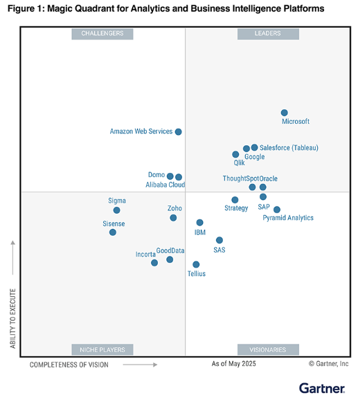

