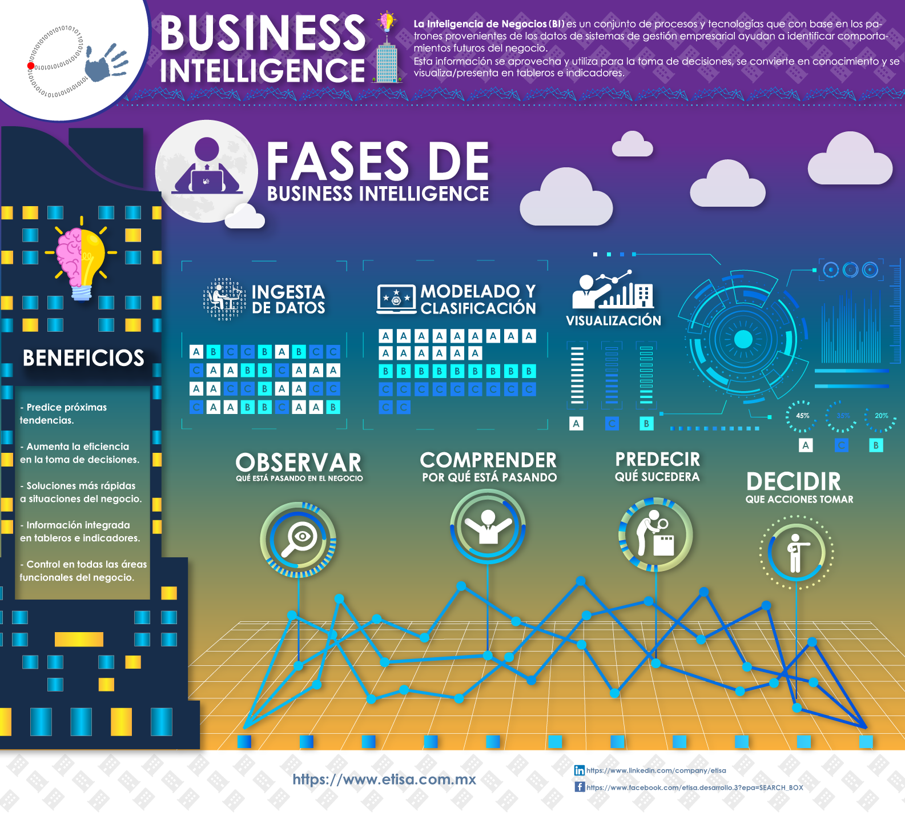

# Presentación

## ¿Nos conocemos?

## ¿Por qué has decidido hacer esta especialización?

¿Qué te motivó principalmente a elegir esta especialización?

- [x] Interés personal por el tema.
- [x] Mejora de oportunidades laborales.
- [x] Recomendación de otros.
- [x] Requisito académico.

## Nuve de conceptos inicial

  *[https://www.menti.com/al7x52rbebkr](Ejercicio Mentimeter)* 

## Reflexión y discusión
A través de la siguiente infografia, reflexionar sobre las finalidades del BI y hacía donde creeis que vamos.

## Evaluación de la asignatura

La evaluación se realizará a través de las siguientes actividades:

| **Instrumento de evaluación**           | **Descripción**                                                                 | **Momento de entrega**           | **Tipo de evaluación**   |
|-----------------------------------------|---------------------------------------------------------------------------------|----------------------------------|--------------------------|
| Prácticas en la plataforma Aules        | Entrega de todas las prácticas realizadas durante el curso                       | A lo largo del curso              | Evaluación continua      |
| Examen intermedio                       | Examen de todo el contenido visto hasta la mitad del curso                       | Mitad de curso                    | Evaluación teórica       |
| Proyecto final                          | Desarrollo y entrega del proyecto final integrador de todos los contenidos       | Final de curso                    | Evaluación práctica      |

