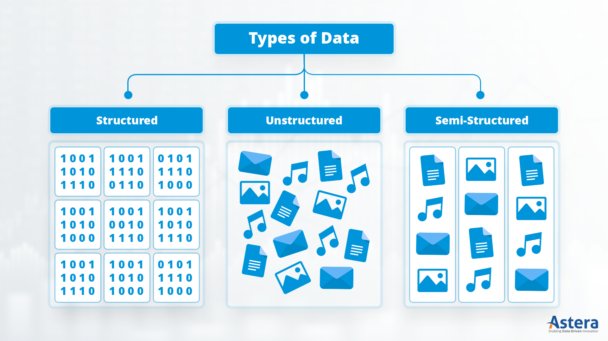
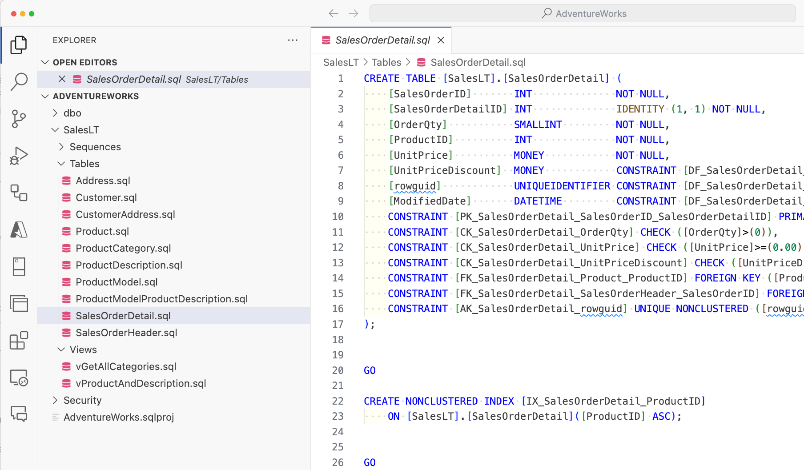
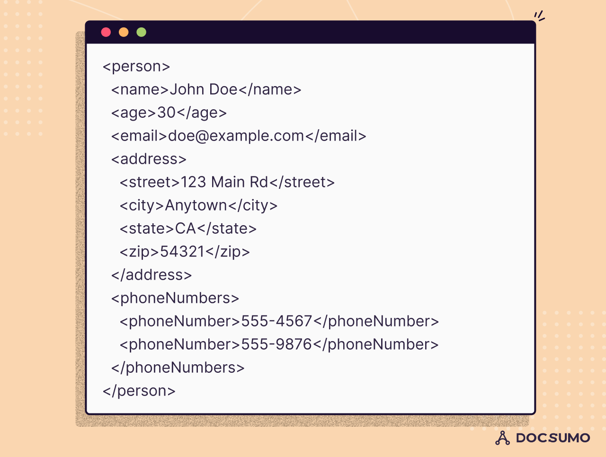
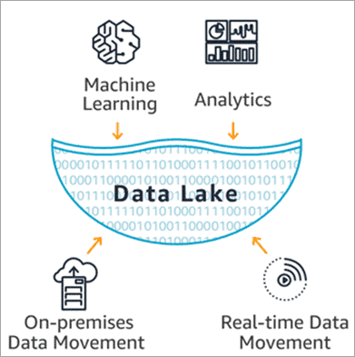

# Tipos de Datos

En el ámbito de la **ingeniería de datos** y el **Big Data**, los datos se clasifican principalmente en tres tipos:  

- **estructurados**, 

- **semiestructurados** y

- **no estructurados**. 

Esta clasificación ayuda a definir la estrategia de almacenamiento, procesamiento y análisis que se debe aplicar en cada caso.

---

## Datos estructurados

Los **datos estructurados** son aquellos que **siguen un formato fijo y bien definido**, normalmente almacenados en tablas con filas y columnas.  Cada elemento de información se ubica en un campo específico y tiene un tipo de dato predeterminado.

### Características
- Organización rígida y bien definida.
- Fácil acceso mediante **consultas SQL** u otros lenguajes estructurados.
- **Alta calidad y fiabilidad**, ya que suelen provenir de sistemas transaccionales.
- Fáciles de validar y procesar automáticamente.

### Ejemplos
- **Bases de datos relacionales** (MySQL, PostgreSQL, Oracle).
- Sistemas de **ERP** (gestión empresarial).
- **Registros de ventas** o facturas.
- Información de clientes con campos como *Nombre*, *Dirección*, *Teléfono*.

### Ventajas
- **Eficiencia en almacenamiento** gracias a su estructura fija.
- **Alta velocidad de búsqueda y análisis** mediante herramientas estándar.
- Mayor facilidad para aplicar reglas de validación y control de calidad.

### Desventajas
- Falta de flexibilidad ante cambios en el modelo de datos.
- No adecuado para información compleja o en formatos variables.

---

## Datos semiestructurados

Los **datos semiestructurados** contienen **información organizada**, pero **no siguen una estructura rígida** como las bases de datos tradicionales. Aunque no se ajustan a un esquema fijo, incluyen **etiquetas o delimitadores** que facilitan su comprensión y análisis.

### Características
- Estructura flexible y adaptable a distintos tipos de datos.
- Uso de **metadatos** para describir la información.
- Más complejos de procesar que los estructurados, pero más manejables que los no estructurados.
- Muy comunes en entornos **web y aplicaciones modernas**.

### Ejemplos
- **JSON** (JavaScript Object Notation).
- **XML** (Extensible Markup Language).
- Archivos de **logs** con campos dinámicos.
- Datos provenientes de **APIs**.
- Información de sensores en **IoT** (Internet of Things).

### Ventajas
- Mayor **flexibilidad** en la forma de representar la información.
- Facilidad de **integración entre sistemas** con distintos formatos.
- Permiten evolución gradual de los datos sin cambios drásticos en el modelo.

### Desventajas
- Mayor **complejidad de análisis** respecto a datos estructurados.
- Necesidad de herramientas específicas para la transformación y normalización.
- Posibilidad de **inconsistencias** en los datos si no se gestionan correctamente.

---

## Datos no estructurados

Los **datos no estructurados** no siguen ningún modelo predefinido ni contienen una organización clara. Representan la mayor parte de la información generada actualmente, especialmente en entornos digitales y redes sociales.

### Características
- Sin esquema fijo, cada archivo o documento puede tener un formato diferente.
- Gran **variedad de formatos**: texto libre, imágenes, audio, video, etc.
- Dificultad para su **procesamiento y análisis automático**.
- Necesidad de técnicas avanzadas como **Machine Learning** o **Procesamiento de Lenguaje Natural (NLP)** para extraer valor.

### Ejemplos
- **Imágenes y videos** (fotografías, grabaciones, cámaras de seguridad).
- **Documentos de texto libre** (Word, PDF, correos electrónicos).
- **Publicaciones en redes sociales** (Twitter, Facebook, Instagram).
- Grabaciones de **audio** (llamadas, música, notas de voz).
- Datos de **sensores en bruto**.

### Ventajas
- Representan la **información más abundante** y rica en contexto.
- Permiten capturar datos complejos que no caben en modelos estructurados.
- Fuente clave para técnicas avanzadas de **analítica predictiva** e **inteligencia artificial**.

### Desventajas
- **Difíciles de almacenar y procesar** con herramientas tradicionales.
- Necesitan gran capacidad de cómputo y almacenamiento.
- Alto costo en tiempo y recursos para limpieza y preparación.

---

## Comparativa general

| Característica          | Estructurados              | Semiestructurados        | No estructurados         |
|-------------------------|----------------------------|---------------------------|--------------------------|
| **Estructura fija**      | Sí                         | Parcial                   | No                       |
| **Facilidad de análisis**| Alta                       | Media                     | Baja                     |
| **Flexibilidad**         | Baja                       | Media                     | Alta                     |
| **Herramientas comunes** | SQL, RDBMS                  | JSON, XML, APIs           | Big Data, NLP, IA        |
| **Ejemplo típico**       | Tabla de clientes           | Archivo JSON de logs      | Video de una cámara      |
| **Volumen en la actualidad** | Menor al 10%               | Aproximadamente 20%        | Más del 70%              |

---

## Estrategias de almacenamiento y análisis

Cada tipo de dato requiere un enfoque específico en su gestión.

- **Estructurados**:
  - Bases de datos relacionales (SQL).
  - Data Warehouses para análisis empresarial.

- **Semiestructurados**:
    - Bases de datos **NoSQL** (MongoDB, Cassandra).
    - Herramientas de integración y transformación (ETL/ELT).

- **No estructurados**:
    - Sistemas de archivos distribuidos como **Hadoop HDFS**.
    - **Data Lakes** para almacenamiento masivo.
    - Algoritmos de IA y ML para análisis avanzado.

---

## Resumen

- **Datos estructurados**: ideales para información tabular y bien definida.  

- **Datos semiestructurados**: flexibles y adaptables, puente entre lo estructurado y lo no estructurado.  

- **Datos no estructurados**: mayor volumen y riqueza, pero requieren técnicas avanzadas para extraer valor.

> En el mundo actual, la **mayoría de los datos generados son no estructurados**, por lo que las empresas deben prepararse para trabajar con ellos mediante herramientas de **Big Data** y **tecnologías de inteligencia artificial**.
