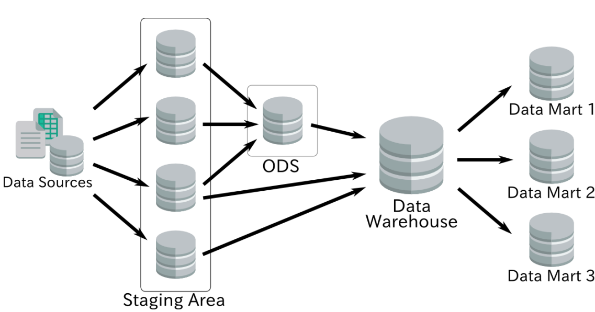
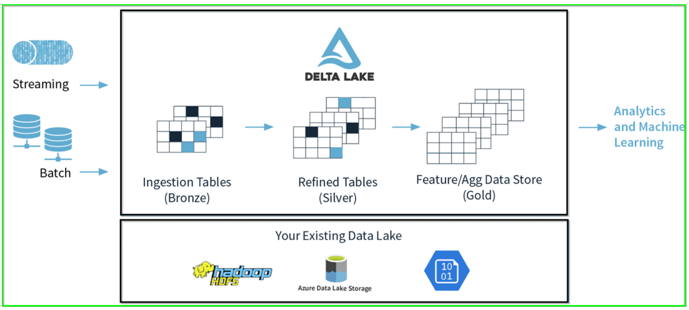
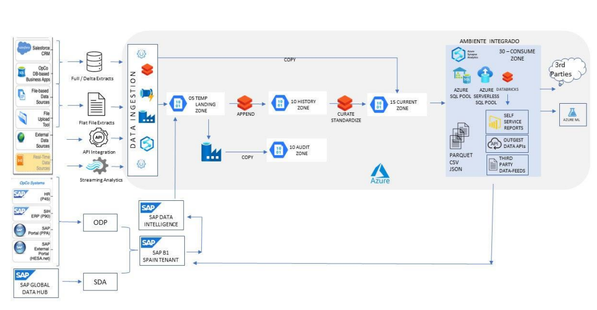

Los entornos se clasifican tanto por su ubicación física (instalación) como por las capas lógicas que gestionan el flujo y la calidad de los datos.

## Entornos

Existen dos enfoques principales para la instalación de los Sistemas de Big Data y BI:

| Entorno | Características |
| :--- | :--- |
| **On-premise** | Implica una **instalación local**. Requiere una infraestructura complicada, un alto coste y mantenimiento constante. |
| **Cloud** (Nube) | Implica una **instalación remota**. Ofrece **reducción de costes**, **mantenimiento automatizado** y **escalabilidad**. |

## Capas lógicas y zonas de la arquitectura

Existen diversas capas donde se procesan y almacenan los datos dentro de una arquitectura de DW:

*   **Staging Area:** Es una zona de base de datos **temporal** donde se extrae la información. Aquí no se suele hacer **ninguna transformación**, y la información se trunca/inserta continuamente.
*   **ODS (Operational Data Store):** Una zona de base de datos donde la información se **prepara en un modelo multidimensional** con tablas maestras y estrellas.
*   **Data Warehouse (DW):** Representa la **combinación de tablas de diferentes capas**, como Stage y ODS. Puede incluir capas agregadas con **datos precalculados**.
*   **Data Mart (DM):** Es un **conjunto de tablas multidimensionales** que representan un **subconjunto de datos** de la empresa (por ejemplo, el departamento de recursos humanos o secretaría).
*   **AUDIT ZONE:** Zona de base de datos utilizada para guardar los **logs de los procesos y ejecuciones** que se desean registrar para un control más robusto de la solución.

## Modelo analítico multidimensional en la nube (Estándar)

Para los entornos *Cloud*, se identifican zonas de flujo de datos basadas en la calidad y el estado de la información, que suelen denominarse Bronce, Silver y Gold:

| Zona | Nombre y Propósito |
| :--- | :--- |
| **Bronce** | **TEMP LANDING ZONE (05):** Zona temporal que ubica las extracciones de información **sin ninguna transformación**. |
| **Silver** | **HISTORY ZONE (10):** Almacena una copia histórica de cada extracción realizada, tanto en formato persistente como en base de datos. |
| **Silver** | **CURRENT ZONE (15):** Mantiene el último estado de los datos, ya **limpios y con las transformaciones necesarias**, en un modelo Datalake/Deltalake. |
| **Gold** | **CONSUME ZONE (30):** La zona final donde el modelo de base de datos (ej., SQL Server) está **preparado para realizar el análisis posterior** con herramientas de BI como PowerBI o Microstrategy. |

