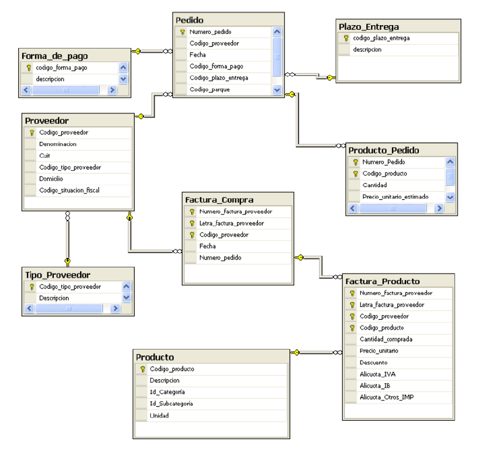

# Modelo Multidimensional (OLAP)

## Conceptos fundamentales

El modelo multidimensional es la base para el diseño de **Almacenes de Datos (Data Warehouses)**, cuyo objetivo es soportar el análisis de información para la toma de decisiones. A diferencia de los modelos transaccionales (OLTP), el modelo multidimensional busca optimizar la rapidez y simplicidad de las consultas.

El diseño de estos modelos se basa en transformar las **preguntas del negocio** en dos componentes esenciales: **Hechos** y **Dimensiones**.

## Componentes clave

### 1. Tabla de Hechos (*Fact Table*)

La tabla de hechos es la **tabla principal o central** del modelo dimensional.

*   **Propósito:** Registra los **eventos del negocio** que se desean analizar, como las **compras** o las ventas.
*   **Métricas o Indicadores:** Contiene los **valores numéricos, medibles y cuantitativos** del evento que se van a analizar (por ejemplo, el financiamiento invertido o el total de películas producidas). Estos valores son generalmente **agregables**.
*   **Granularidad:** Los hechos se registran a un alto nivel de **atomicidad** o **mínima expresión**, lo que se conoce como granularidad.

### 2. Tablas de Dimensiones (*Dimension Tables*)

Las dimensiones proporcionan el **contexto** o la **perspectiva de análisis del hecho**. Son atributos que describen los datos indicados en los hechos (metadatos).

*   **Contenido:** Las dimensiones contienen la información **descriptiva** de los hechos. Aunque suelen tener menos registros que la tabla de hechos, cada registro puede tener un gran número de atributos descriptivos.
*   **Ejemplos comunes:** Los contextos típicos incluyen el tiempo (fecha, mes, año), la geografía (país, provincia, ciudad), los productos, o los proveedores.
*   **Jerarquías:** Las dimensiones a menudo contienen **jerarquías** o relaciones internas. Por ejemplo, a partir de una dimensión base como la fecha de estreno, se pueden derivar el trimestre, el mes, el año y la década.

## Esquemas comunes

El modelo multidimensional se representa típicamente mediante dos esquemas:

### Esquema en Estrella (*Star Schema*)
El **Esquema en Estrella** es el modelo dimensional ideal por su **simplicidad y velocidad** para el análisis (OLAP).

*   **Estructura:** Una tabla de hechos central está **rodeada** por tablas de dimensiones.
*   **Ventajas:** Las consultas (*JOINs*) solo involucran a la tabla de hechos y a las de dimensiones, simplificando la consulta y mejorando el rendimiento. Se considera el esquema **ideal** para la visualización de datos.

### Esquema en Copo de Nieve (*Snowflake Schema*)
Este esquema es **más complejo** y se presenta cuando las dimensiones están **normalizadas** (una dimensión tiene más de una tabla asociada).

*   **Desventaja:** La tabla de hechos **no está relacionada directamente** a todas las tablas que componen el modelo de datos, lo que requiere uniones (JOINs) encadenadas y más complejas. Su objetivo principal es **disminuir el almacenamiento**.

---

# EJERCICIO. Diseño del modelo Multidimensional de Compras

Para construir el **Modelo Multidimensional de Compras**, se deben seguir los pasos de la metodología analítica, identificando el hecho, los indicadores y las dimensiones necesarias para responder a las preguntas gerenciales.

Dado el siguiente modelo de datos transaccional:

## 1. Identifica las tablas de Hechos

El hecho principal objeto de análisis en este contexto es:

*   **Hecho (Fact):** 

## 2. Identifica posibles Hechos y sus posibles calculos

Los cálculos (o métricas) son los valores numéricos que la gerencia desearía analizar en función del evento "Compra".

| Criterio | Ejemplos de Indicadores (Medidas) |
| :--- | :--- |
| **Cuantificación** |  |
| **Financiero** |  |
| **Contable** |  |

## 3. Identifica las Dimensions/Catalogos

Las dimensiones definen las perspectivas de análisis para desagregar los indicadores de Compras (el contexto de *quién*, *qué*, *cuándo* y *dónde*).

| Dimensión | Atributos descriptivos |
| :--- | :--- |

*Nota: Identificar jerarquías dentro de estas dimensiones es clave para el diseño.*

## 4. Construir el modelo multidimensional

El diseño recomendado es el **Esquema en Estrella**, debido a su simplicidad para las consultas analíticas.

## 5. Describe textualmente el modelo y que contiene

*   **Contenido:** 
*   **Análisis:**
*   **Beneficio:**

## 6. Analizar otras posibilidades de diseños

Además del diseño base, se pueden considerar alternativas para mejorar la eficiencia del análisis:

1.  **Data Marts (DM):** 
2.  **Capas Agregadas:** 

### ENTREGABLE 

Hay que facilitar un documento con todos los puntos del ejercicio y el diseño. 