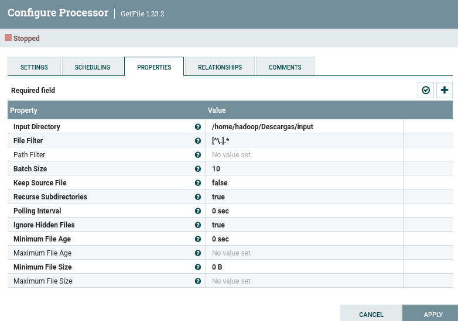
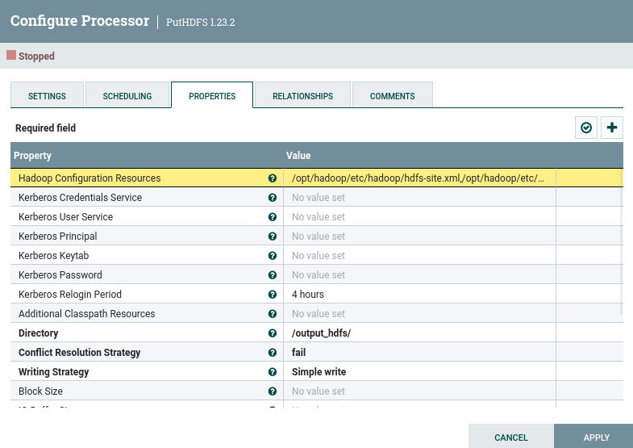
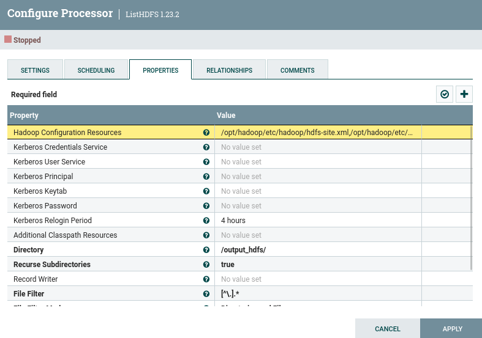
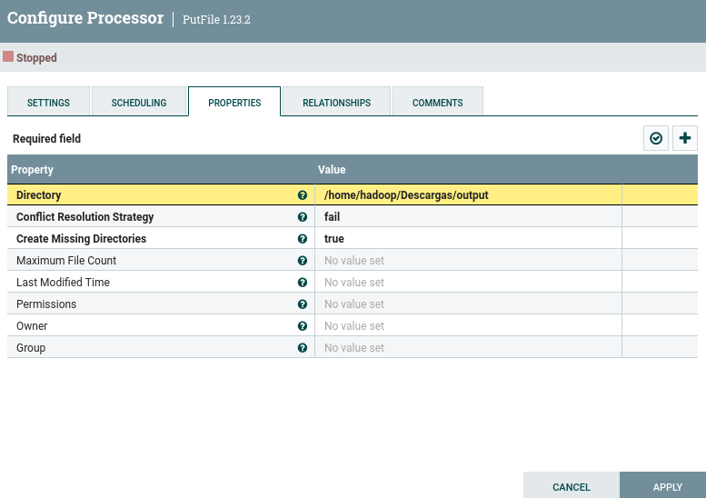

## Traspaso de archivos FS y volcado a HDFS
Debemos transferir una gran cantidad de archivos del sistema de la máquina virtual Linux al sistema de archivos de Hadoop HDFS, también localizado en la misma máquina virtual. Para evitar generar un script con muchas instrucciones como `hdfs dfs -put ...`, lo cual podría ser tedioso, implementaremos un proceso en NiFi que automatice esta tarea. Una vez que los archivos estén en el sistema HDFS, será necesario implementar un proceso para devolver estos archivos desde el sistema de archivos HDFS al sistema de archivos local. Este proceso permitirá automatizar esta tarea y realizarla periódicamente.
## Consideraciones 
- [x]  NiFi debe ubicarse en el directorio `/opt`, al igual que Hadoop. Como usuario root, copiarlo. Eliminar el archivo zip de NiFi para liberar espacio en el disco duro de la máquina virtual.
```bash
[root@nodo1 opt]# cp -R /home/hadoop/Descargas/nifi-1.23.2 nifi
```
- [x]  Asegurar que el directorio de NiFi (`/opt/nifi`) tenga permisos de ejecución para que NiFi y Hadoop puedan interactuar.

```bash
[root@nodo1 opt]# chown -R hadoop:hadoop nifi
[root@nodo1 opt]# chmod -R 777 nifi
```
- [x]  Si el directorio en HDFS al que enviamos los archivos no existe, el proceso debe crearlo.
- [x]  NiFi debe tener permisos sobre HDFS.
- [x]  Los directorios en HDFS deben tener permisos para que NiFi pueda escribir en ellos.
## Pasos a seguir 
1. Crear un directorio llamado `input` en el sistema de archivos de la máquina virtual Linux, donde se ubicarán los archivos que queremos trasladar al sistema HDFS.
2. Implementar y configurar el procesador correspondiente para leer los archivos de este directorio del sistema de archivos de Linux. Este procesador recogerá todos los archivos del sistema de archivos de la máquina virtual en el directorio que hemos creado y los trasladará al sistema HDFS de Hadoop.
<div align="center">

</div>
En la propiedad de Hadoop Configuration Resources hay que poner los siguientes ficheros de configuración de Hadoop:
```bash
/opt/hadoop/etc/hadoop/hdfs-site.xml,/opt/hadoop/etc/hadoop/core-site.xml
```
3. Implementar y configurar el procesador correspondiente para realizar un `put` de los archivos al sistema HDFS de Hadoop en un directorio llamado `output_hdfs`. Si el directorio no existe, el proceso deberá crearlo con los permisos del usuario que ejecuta (hadoop).
<div align="center">

</div>
4. Validar mediante el comando:
```bash
hdfs dfs -ls /
```
En el sistema de archivos HDFS que el directorio se ha creado con los permisos correctos y que los archivos han llegado correctamente. También se puede validar utilizando la página web de HDFS: [http://nodo1:9870/explorer.html](http://nodo1:9870/explorer.html).
5. Añadir un nuevo procesador a NiFi que recoja los archivos del sistema HDFS del directorio "output_hdfs" y los traslade a un directorio "output" en el sistema de archivos Linux.
<div align="center">

</div>
<div align="center">

</div>
**Ayuda:** [NiFi Documentation (apache.org)](https://nifi.apache.org/docs.html)
## Entregable
Un PDF con capturas de pantalla de todo lo implementado y de los resultados en los directorios, tanto en HDFS como en el sistema local.