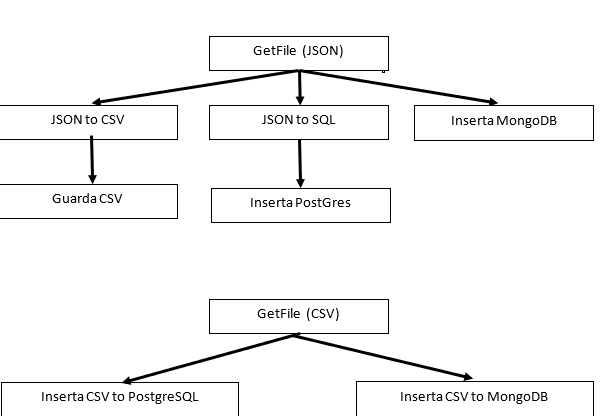

# Transformando datos con NiFi
## Enunciado
En la práctica anterior de la API del INE consultamos la encuesta de población activa. Vamos a continuar con esta práctica leyendo los datos con NiFi.

Recordemos que es necesario averiguar el código para realizar esta consulta, y nos devolverá un JSON:  

!!! note "Recordar"
    http://servicios.ine.es/wstempus/js/ES/DATOS_SERIE/<código serie>?nult=<número datos>

Ahora transferiremos estos datos para prepararlos para su uso futuro.

Vamos a utilizar, como en la práctica, dos carpetas: una donde dejaremos los archivos de origen y otra donde dejaremos la transformación.
## Ejercicio

a) Haz que tome el JSON, lo transforme y lo guarde como CSV.  
b) Haz que tome el JSON y lo guarde en PostgreSQL.  
c) Haz que tome el JSON y lo guarde en MongoDB.  
d) Haz que tome el CSV aplanado del punto anterior y lo guarde en PostgreSQL.  
e) Haz que tome el CSV y lo guarde en MongoDB.  

## Notas
-   Como la carpeta de entrada es la misma, deberás filtrar los procesadores **GetFile** por extensión. 

-   Aprovecha al máximo los componentes, por ejemplo, utilizando el número mínimo posible de **GetFile**.  

-   Utiliza el procesador **LogAttribute** para comprobar si ha habido errores o si todo ha funcionado correctamente, verificando las colas que se crean para acceder al componente.  

-   Procesadores a utilizar: *GetFile*, *ConvertJSONtoSQL*, *ConvertRecord*, *PutDatabaseRecord*, **PutSQL*, *PutFile*, *PutMongoRecord* y *LogAttribute*.  

-   Asegúrate de que cada archivo CSV tenga un nombre diferente para evitar sobrescribir cada transformación. 

La estructura de nuestro proyecto NiFi deberá ser similar al siguiente esquema:

## Entregable

Realiza un documento PDF con las capturas necesarias para demostrar que el sistema funciona correctamente y entrégalo junto con el Flow Definition.