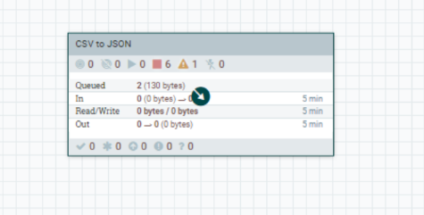
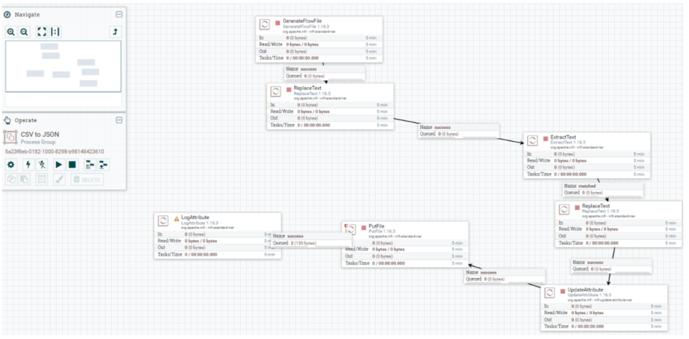
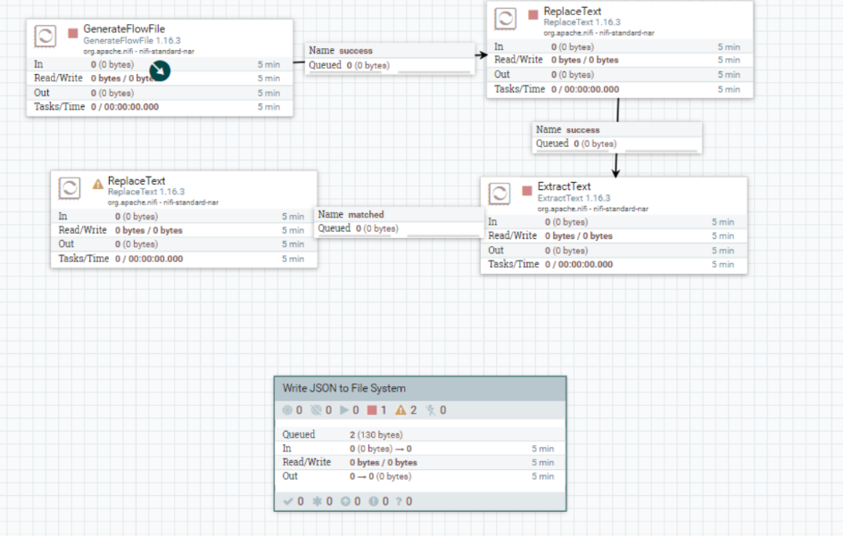
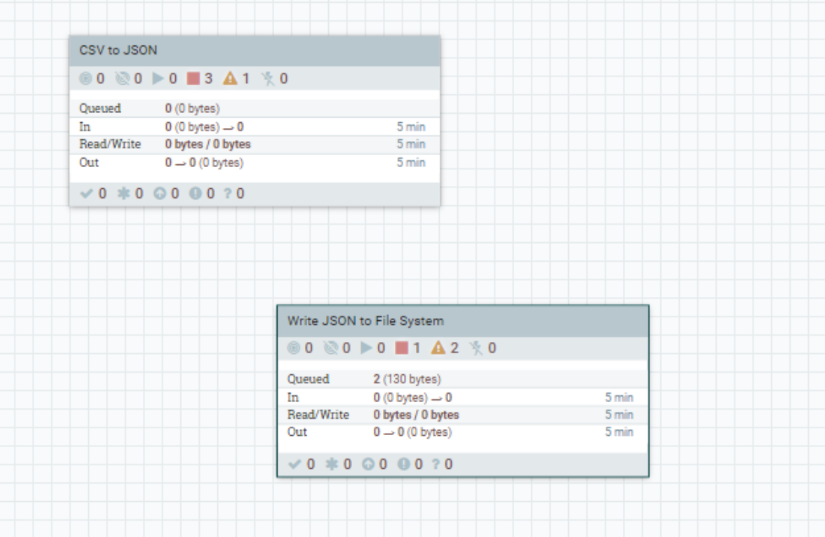
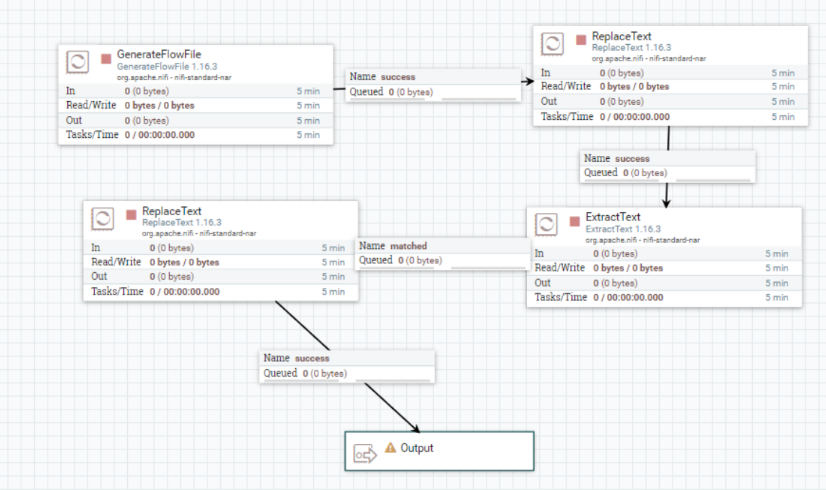
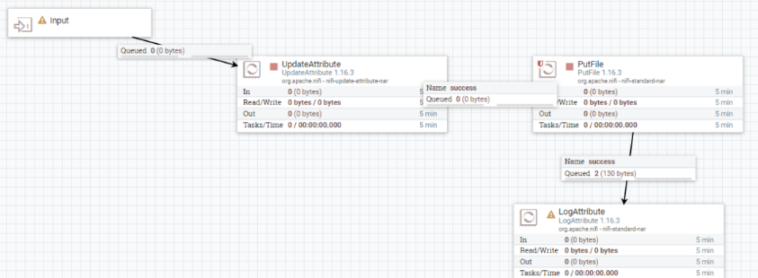
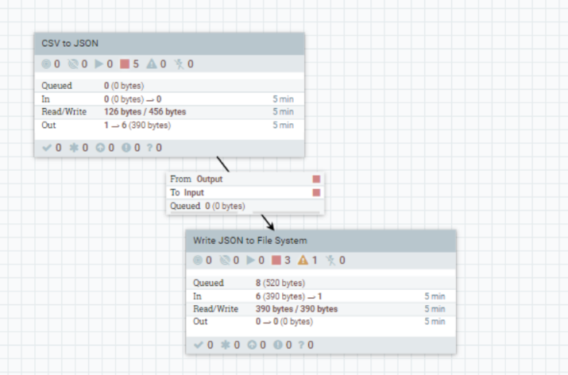

## Process group, Input-Output port

En NiFi uno o más processor son conectados en un process group. Podemos añadir un 
process group arrastrando el icono de la barra de herramientas .
Partiendo de la practica 3. 
Cogemos y añadimos un nuevo process group y le ponemos como nombre “CSV to JSON” (*es posible obviar este paso, si ya se ha puesto la anterior practica en un process group, duplicandolo y renombrandolo a CSV to JSON*)
Para decirle como usar los processor’s, debemos seleccionar todos los processor (con 
la tecla shift) y arrastrarlos sobre el process group

Para ver los componentes de un Process Group, hacemos doble click y accedemos al 
detalle. 

Para salir fuera del detalle, con botón derecho “*leave group*” saldremos de nuevo 
fuera.

**Nota: Es recomendable utilizar los Process Group para lógicas complejas. Es posible duplicar un process group heredando la misma configuración.**

A veces, un Process Group puede generar una salida para utilizar en otros procesos. 
Vamos a transferir información des de un Process Group a otro. Para ello vamos a 
utilizar de la barra de herramientas el “*input*” y el “*output*” port .
El actual flujo de datos, lo vamos a partir en dos Process Group de la siguiente manera:
Creamos un nuevo Process Group que se llame “*Write JSON to File System*” dónde 
vamos a introduir los processors des de el “*UpdateAttribute*” hasta el último 
“*LogAttribute*”.

Cómo ya tenemos un process group principal “*CSV to JSON*”, vamos a sacar el 
process group “*Write JSON to File System*” fuera para poder ejecutarlos 
conjuntamente. Para ello hacemos botón derecho sobre “*Write JSON to File 
System*” y seleccionamos “*Move to parent group*”.

Ahora el problema está en que los dos processor group es necesario que se 
comuniquen para que funcionen. Para ello haremos uso del Input/Output port.
Accedemos al process group “*CSV to JSON*” y añadimos un “*Output port*”.

Salimos del grupo y accedemos ahora al Process Group “*Write JSON to CSV*” y añadimos un “*Input port*” al inicio.

Salimos al flujo principal, dónde ahora vamos a conectar los dos Process Group. Saldrá 
el mapeo de entradas y salidas, hay que tenerlo en cuenta cuando tengamos más de 
una entrada/salida que este bien asociado.

Ahora solo queda arrancar con botón derecho “*start*” y validar que todo funciona 
correctamente.

**Nota: Dentro de un mismo Process Group no es posible conectar un “*Output port*” a un “*Input port*”.**

## ENTREGABLE 

Hay que exportar la practica con un Processor Group que genera un .json y entregarlo en Aules con el número de la práctica y el nombreApellidos. Por ejemplo:  *P4_NomAlumnoApellidos.xml*