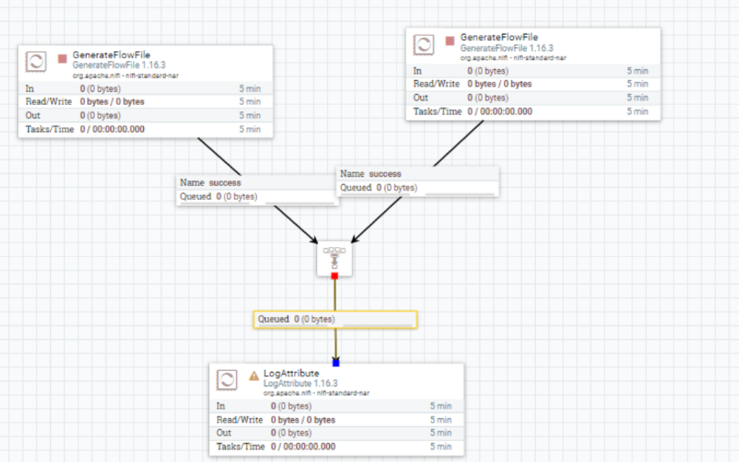

## Funnel

- Combinar datos de varias conexiones en una sola.

- Vamos a revisarlo de forma rápida, se trata de como coger varias fuentes de datos y pasarlas por un solo componente para llegar a otro componente.

- Añadimos dos processor “*GenerateFlowFile*” a una nueva hoja de trabajo.

- Añadimos un “*Funnel*” des de la barra de herramientas.

- Añadimos un processor “*LogAttribute*”.

- Enlazamos los dos processor “*GenerateFlowFile*” al “*Funnel*”.

- Y el “*Funnel*” lo enlazamos con el ”*LogAttribute*”.

## ENTREGABLE 

Hay que exportar la practica con un Processor Group que genera un .json y entregarlo en Aules con el número de la práctica y el nombreApellidos. Por ejemplo:  *P6_NomAlumnoApellidos.xml*