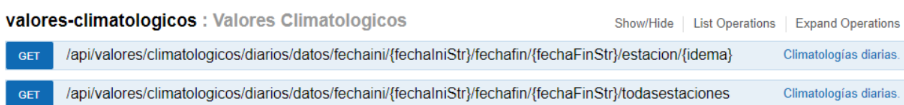

Dadas las intensas temperaturas que se están dando estos últimos meses de 2022, 
necesitamos analizar y comparar con los años 2020 y 2021 de manera mensual la temperatura 
media y la acumulación de lluvia. 

Para ello vamos a necesitar obtener como fuentes de 
información del INE la relación de provincias y municipios de España, del AEMET la relación de 
datos meteorológicos de todas las estaciones de España y generar un catálogo de fechas.
Los datos que obtenemos de las diferentes fuentes de datos, los vamos a volcar en una base 
de datos ‘Definir qué base de datos, p.e. PostgreSQL’ en una capa de tablas Staging, para 
descargar los sistemas origen. 

Luego realizaremos los tratamientos necesarios y los volcaremos 
a las capas finales en la base de datos, a los catálogos/dimensiones y estrella (ods).
Ya preparado el modelo multidimensional, tenemos dos opciones según tiempo: generar un
agregado sobre la capa ods con cálculos (kpi’s) ya hechos para agilizar la lectura de la 
aplicación de reporting o directamente pasar a la herramienta de reporting a 
pintar/analizar/calcular kpis.
Sacar conclusiones a través de la herramienta de reporting con tablas, informes y gráficos.

Anexo
Fechas
Añadir fuente/consulta sql para añadir datos del catálogo fecha.

[INE: Relación Provincia-Municipio](https://www.ine.es/daco/daco42/codmun/22codmun.xlsx)

AEMET
Es necesario pedir una Api Key
[https://opendata.aemet.es/centrodedescargas/docs/FAQs170621.pdf](https://opendata.aemet.es/centrodedescargas/docs/FAQs170621.pdf)

[https://opendata.aemet.es/centrodedescargas/inicio](https://opendata.aemet.es/centrodedescargas/inicio)

[https://opendata.aemet.es/dist/index.html?#!/valoresclimatologicos/Climatolog%C3%ADas_diarias](https://opendata.aemet.es/dist/index.html?#!/valoresclimatologicos/Climatolog%C3%ADas_diarias)

Herramientas para desarrolladores 
Servicio web datos diarios estación meteorológica de todas las estaciones, entre ellas, Xativa.

 

Nos devuelve un JSON.