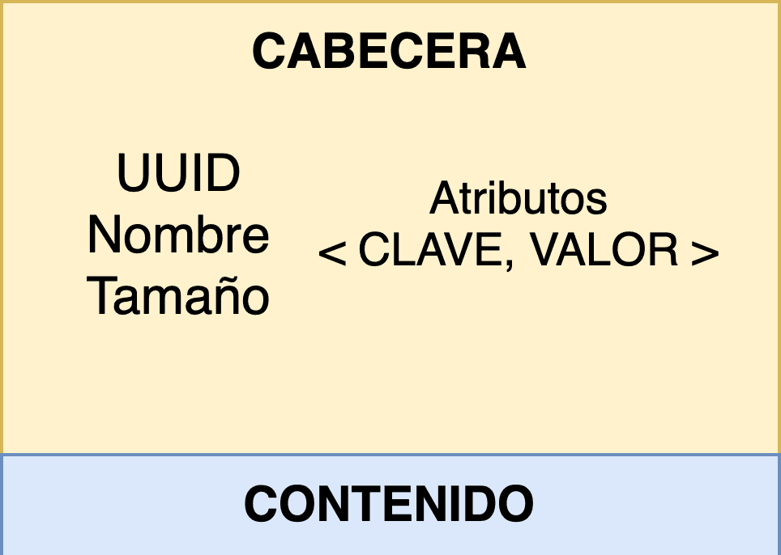
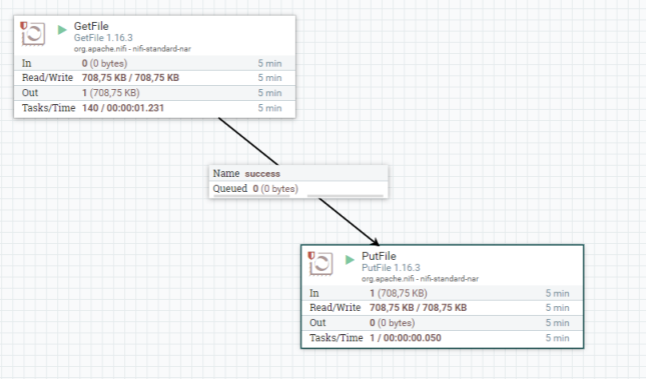

# NiFi
<div align="center">

</div>

## ¿Qué es Apache NiFi?

Apache NiFi es un sistema distribuido dedicado a extraer, transformar y cargar datos (ETL). Es **Open Source** y está desarrollado y mantenido por la Apache Software Foundation.

NiFi (o Ni-Fi) ha sido diseñado para poder automatizar de una manera eficiente y visual los flujos de datos entre distintos sistemas: ingesta, enrutado y gestión. Para ello, cuenta con más de 300 conectores externos ya implementados y además es posible añadir conectores a medida.

Uno de los puntos fuertes de NiFi es la capacidad para programar flujos de datos arrastrando y conectando los componentes necesarios sobre los canvas de la web de administración. No es necesario por tanto tener conocimientos de programación específicos, sino entender y configurar correctamente cada uno de los componentes que se quieren usar.

Aunque se pueda considerar una herramienta ETL, NiFi no está realmente optimizado para realizar transformaciones de datos complejas o pesadas. Es posible realizar transformaciones de datos ligeras pero no es un motor de transformaciones batch completo. Aún así es común su uso integrado en sistemas Big Data, ya que ofrece muchas ventajas como herramienta de automatización de ingestas de datos y para realizar transformaciones y limpiezas sencillas.

##Componentes principales
###Básicos
**Flow**: El workflow o topología es la definición del flujo de datos que se implementa en NiFi e indica la forma en la que se deben gestionar los datos.

**Flowfile**: Es el paquete de datos que viaja por el flow entre los procesadores. Está compuesto por un puntero al propio dato útil o contenido (un array de bytes) y metadatos asociados llamados atributos. Los atributos pares clave-valor editables y NiFi los usa para enriquecer la información de provenance. Los metadatos más importantes son el identificador (uuid), el nombre del fichero (filename) y el path.

Para acelerar el rendimiento del sistema, el flowfile no contiene el propio dato, sino que apunta al dato en el almacenamiento local. Muchas de las operaciones que se realizan en NiFi no alteran el propio dato ni necesitan cargarlo en memoria. En concreto, el dato se encuentra en el llamado repositorio de contenido (Content Repository)



<div align="center">

</div>

<div align="center">

</div>

<div align="center">

</div>

**Processor**: Los procesadores son los componentes principales de NiFi. Se encargan de ejecutar el proceso de extracción, transformación o carga de datos. NiFi permite realizar operaciones diversas en los processors, así como distribuir y programar su ejecución. Estos componentes también proporcionan una interfaz para acceder a los flowfiles y sus propiedades. Se pueden implementar nuevos processors personalizados mediante una api de programación en Java o bien usar los más de 280 processors existentes.

Los processors permiten abstraer la complejidad de la programación concurrente y pueden ejecutar en varios nodos de forma simultánea o bien en el nodo primario del clúster. Además, es posible programar su ejecución mediante cron, tiempo predefinido o mediante eventos de entrada. Los processors también tienen relaciones de salida (connections) en función de su comportamiento, por ejemplo éxito (success), fallo (failure) o reintento (retry). Llevan incorporado un validador de configuración y gráficas con las estadísticas de uso e indicadores de trazabilidad.

### Avanzados

**Connection**: Son las tuberías de conexión entre dos Processors que les permiten interactuar. Es la encargada de transmitir los flowfiles entre los componentes y de gestionar las colas y su capacidad. Las conexiones actúan como un buffer para los flowfiles, y tienen un sistema de backpressure en función del número de eventos o del tamaño en disco. También es posible establecer la caducidad para los flowfiles o su prioridad. Mediante los funnels, NiFi permite agrupar varias conexiones en una.

**Process Group**: Agrupación de processors y connections para tratarlos como una unidad lógica independiente dentro del flujo de procesamiento. Para interactuar con el resto de componentes tienen puertos de entrada y de salida que gestionan el envío de flowfiles.

NiFi también incorpora los llamados Remote Process Groups (RPGs). Permiten tratar otra instancia o clúster externo de NiFi como un Process Group con el que interactuar. En vez de mover flowfiles entre diferentes process groups, se mueven entre distintos clústers. Los puertos de entrada y de salida actúan como puertas de entrada para los flowfiles.

**Controller Service**: Los controller service o controladores se utilizan para compartir un recurso entre distintos processors. Por ejemplo puede ser una conexión a una base de datos, a S3 o a un contenedor de Azure.

Apache NiFi también nos permite crear plantillas (templates) con un flow almacenado. Las plantillas resultan muy útiles para añadir de forma rápida un nuevo conjunto de componentes estándar o mover sub-flujos entre distintos entornos de trabajo.

### Processor más utilizados
#### Ingesta del dato
    
    GenerateFlowFiles​
    GetFile​
    GetFTP​
    GetSFTP​
    GetJMSQueue​
    GetJMSTopic​
    GetHTTP​
    ListenHTTP​
    ListenUDP​
    getHDFS​
    GetKafka​
    QueryDatabaseTable​
    GetMongo​
    GetTwitter​
    ListHDFS / FetchHDFS

#### Transformación del dato
    
    ConvertRecord​
	UpdateRecord​
	ConvertJSONToSQL​
	ReplaceText​
	CompressContent​
	ConvertCharacterSet​
	EncryptContent​
	TransformXml​
	JoltTransformJSON
    SplitText​
	SplitJson​
	SplitXml​
	SplitRecord​
	SplitContent​
	UnpackContent​
	SegmentContent​
	MergeContent​
	QueryRecord

#### Envío del dato

    PutEmail​
	PutFile​
	PutFTP​
	PutSFTP​
	PutJMS​
	PutSQL​
	PutKafka​
	PutMongo​
	PutHDFS

#### Acceso a bases de datos
    
    ConvertJSONToSQL​
    ExecuteSQL​
    PutSQL​
    SelectHiveQL​
    PutHiveQL​
    ListDatabaseTables

#### Extracción de atributos

    EvaluateJsonPath​
    EvaluateXPath​
    EvaluateXQuery​
    ExtractText​
    HashAttribute​
    HashContent​
    IdentifyMimeType​
    UpdateAttribute​
    LogAttribute

## Arquitectura

Apache NiFi es una aplicación Java que ejecuta en la JVM. En la imagen a continuación podemos ver los componentes más importantes de su arquitectura.

El **Flowfile Repository** o repositorio de flowfiles almacena los atributos y del estado de cada flujo del sistema, junto a las referencias al contenido. También almacena la cola en la que se encuentra en ese momento. Mantiene solamente el estado más actualizado del sistema mediante el Write-Ahead Log, lo que garantiza recuperar el estado más actualizado frente a una caía del sistema.

Los **flowfiles** se almacenan en un Hashmap en memoria. Cuando el número de flowfiles en esta estructura excede el establecido en la propiedad nifi.queue.swap.threshold, NiFi los escribe a un fichero swap en disco según su prioridad.

El **Content Repository** mantiene todo el contenido de los flowfiles. Cada vez que un dato se modifica se realiza una copia para no perder el original (copy on write). Pueden existir varios content repositories en un sistema, cada uno de ellos llamado contenedor y a su vez dividido en secciones.

Por último el **Provenance Repository** se encarga de almacenar la información de la procedencia y el origen de cada flowfile mediante snapshots a partir de los que se podría restaurar el ciclo de vida de cada uno. Este repositorio añade la dimensión del tiempo.

En los sistemas en los que NiFi tiene un volumen de datos muy alto, es posible que el content repository llene el disco, y en el caso de que el flowfile repository se encuentre en el mismo disco, podría corromper su contenido, por lo que es algo a tener en cuenta al diseñar la solución.


## Streaming en NiFi

Para los casos de uso de Streaming, Apache NiFi es una tecnología con sus limitaciones. Por un lado, no está diseñado para realizar joins sobre flowfiles de manera eficiente ni agregaciones de datos en ventanas de procesamiento.

Una de las maneras de tratar los casos de uso de streaming es escribir los registros en un clúster de Apache Kafka. Una vez en Kafka, se podrán procesar fácilmente com **Kafka Streams** o **Apache Flink**.
## Ejemplo

 

En la imagen a continuación podemos ver un ejemplo de un flujo en Apache NiFi. Este flujo se compone de dos processors: GetFile y PutFile.

También existen 2 conexiones, cada una de ellas se corresponde un un evento particular generado por el processor del que parte. Actúan de cola para los flowfiles generados.

El propósito del flujo es conseguir flowfiles en el primer processor de un origen (sftp, localhost,etc) y escribir los datos en el disco local mediante el processor PutFile.

## Ventajas

Facilidad de uso mediante UI

Escalable horizontalmente

Gran cantidad de componentes out-of-the-box (processors y conectores)

Es posible implementar nuevos componentes y procesadores (programando con la API de Java)

Se encuentra en constante evolución y con una gran comunidad

Incorpora auditoría del dato

Tiene integrada la validación de configuraciones

Política de Usuarios (LDAP)

Software multiplataforma

Linaje de datos integrada, de cara a cumplir regulaciones.

Uso para enrutar mensajes a microservicios

Integrado en Cloudera Data Platform (CDP) – Cloudera Flow Management (CDF)

## Inconvenientes

Consumo de recursos de hardware muy elevado en función de la carga de procesamiento

Otras herramientas como Apache Flume son más ligeras y adecuadas para realizar transformaciones de datos simples

## Alternativas

!!! note "Existen alternativas a Apache NiFi"
    Como soluciones para gestionar dataflows, cada una con sus particularidades:

    Streamsets
    Azure Data Factory
    AWS Data Pipeline

Mucha gente se pregunta el motivo de usar NiFi cuando ya se está usando Apache Kafka como punto de entrada al sistema de datos. Debemos tener en cuenta que Kafka está diseñado para casos de uso de streaming y manejar ficheros de datos pequeños.

NiFi puede manejar ficheros de datos mucho más grandes que Apache Kafka. Además, NiFi proporciona una interfaz muy potente que permite controlar y administrar las operaciones de ingesta y de transformación de forma sencilla y centralizada. También debemos tener en cuenta la gran cantidad de conectores y procesadores que aporta NiFi, por lo que ambas tecnologías son complementarias.

## Instalación NiFi

Nos descargamos en binario de la web oficial.​ Ocupa más de 1GB porque contiene todos los procesadores. Además, necesitamos tener Java​ instalado.

1.  **Descargamos** NiFi:
    [NiFi](https://www.apache.org/dyn/closer.lua?path=/nifi/2.0.0/nifi-2.0.0-bin.zip)
2.  **Descomprimimos** el zip en el directorio */opt/*
3.  Nos **situamos** en la carpeta */bin/*
4.  Vamos a /conf/ y modificamos el nifi.propierties las siguientes propiedades:
    
    ```bash
            nifi.remote.input.secure=false
            nifi.web.http.host= ip de tu maquina
            nifi.web.http.host= puerto de tu maquina, p.e. 8443
            nifi.web.https.host=
            nifi.web.https.port=
    ```

5.  **Iniciamos** por primera vez NiFi. Ejecutamos:

  ```bash
        ./bin/nifi.sh start (Unix)
        ./bin/nifi.bat start (MSDOS)
  ```
    
6.  **Acceso**. Utiliza por defecto el puerto 8443 (Linux)​

    *[https://localhost:8443/nifi](https://localhost:8443/nifi)* (Puede tardar)​

> Nota: Si no es el 8443 se puede hacer un grep al log buscando 127.0.0.1

Para terminar. **Obtenemos el usuario**. El usuario se puede crear vía comandos por cmd, o se puede coger el que genera automáticamente en el log NiFi en el fichero *nifi-app.log*:	​

       ```bash
        Generated Username [80e91118-b222-4b47-8dab-63a8deb7905d]​
        Generated Password [zavwbGlRcYeky51Bxc0zbVN8hj2bE61u]​
       ```

Si queremos **personalizar el usuario**:​
            
        ```bash
        /bin/nifi.sh set-single-user-credentials USERNAME PASSWORD
        ```
            
Instalar como servicio NiFi

        ```bash
        bin/nifi.sh install dataflow.
        ```

Una vez instalado, puedes hacer "start" o "stop" con los comandos apropiados. También consultar el estado actual.
        
        sudo service nifi start

        sudo service nifi stop
        
        service nifi status