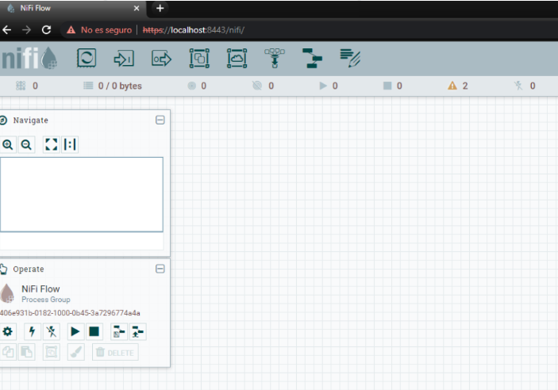

## Mover un fichero de un origen a un destino

**Iniciamos** NiFi. Ejecutamos:

        ./bin/nifi.sh start (Unix)
        
        ./bin/nifi.bat start (MSDOS)

**Accedemos** a la siguiente url que se levantará en el ordenador (*o la que indica el 
Readme, según la versión funcionara una u otra*): 

[https://localhost:8443/nifi/](https://localhost:8443/nifi/)

**Pedirá unas credenciales**. Podemos utilizar las creadas de manera automática 
al arrancar por primera vez en el fichero de logs que podréis encontrar en: *logs/nifiapp.log*. Lo encontrareis buscando la siguiente palabra clave: *Username*

Una vez hayamos hecho login, nos aparecerá la interfaz de trabajo.

En la **barra de iconos de herramientas**, hacemos clic en “*Processor*” y arrastramos 
hacia el área de trabajo

En la ventana de “*Add Processor*” búscamos *getFile*. Y hacemos clic en “*Add*”.

Repetimos el mismo proceso para añadir el processor “*putFile*”. Quedando algo similar 
a la siguiente imagen.

Ahora, vamos a **configurar** de dónde vamos a coger el fichero *origen* y dónde lo vamos a dejar en el *destino*. 

**Hacemos clic** botón derecho en “*GetFile*” en “*Configure*” y vamos a la pestaña 
“*Properties*”. Dónde podemos ver los diferentes aspectos que son configurables. 
Ahora mismo sólo vamos a indicar el directorio de entrada “*Input Directory*”.

Hacemos clic botón derecho en “*PutFile*” en “*Configure*” y vamos a la pestaña 
“*Properties*”. Dónde podemos ver los diferentes aspectos que son configurables. 
Ahora mismo sólo vamos a indicar el directorio de entrada “*Directory*”.

Ya configurado el componente del origen de los ficheros y el destino, sólo nos queda 
unirlos. Si hacemos clic sobre el componente “*GetFile*” veremos una flecha que nos 
permitirá arrastrarla hasta el otro componente “*PutFile*”. Quedando como la siguiente 
imagen:

Ahora nos queda probar que traslada correctamente los ficheros, arrancando los dos 
componentes con botón derecho y hacer clic en “*Start*”. En los dos componentes. 
Primero el “*GetFile*” y luego el “*PutFile*”.

Si al realizar la acción no sale la opción en el “*PutFile*” lo que hay que hacer es entrar 
en este componente en propiedades e indicarle que acción debe hacer en el caso de 
que falle

Una vez todo configurado y en estado “*Start*” veréis que empieza a mover el fichero 
del origen configurado al destino. Marcado con verde como que se ha ejecutado 
correctamente

## ENTREGABLE 

Hay que exportar la practica con un Processor Group que genera un .json y entregarlo en Aules con el número de la práctica y el nombreApellidos. Por ejemplo:  *P1_NomAlumnoApellidos.xml*