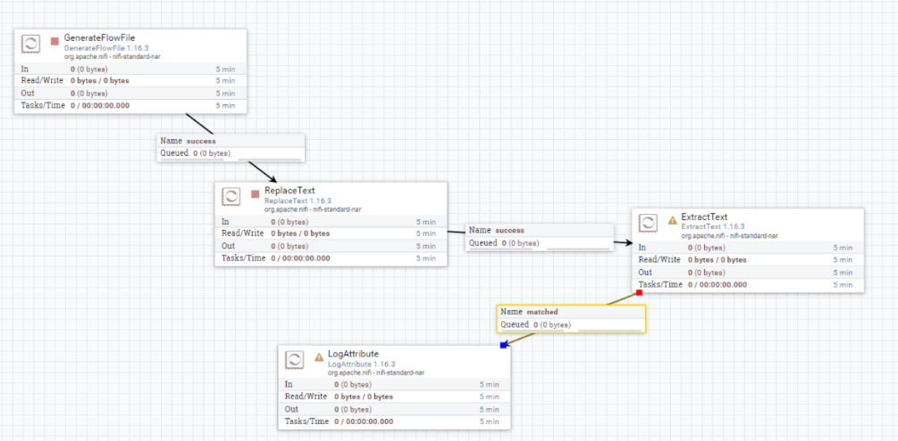
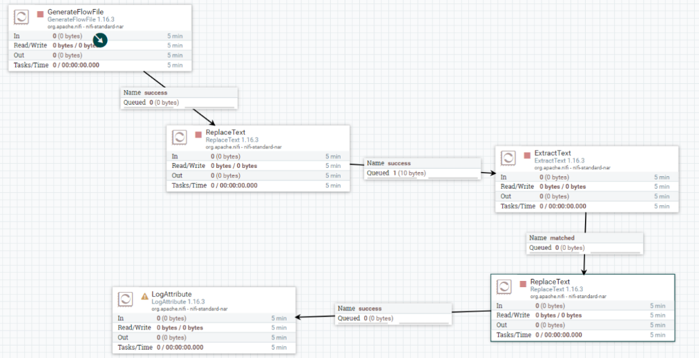
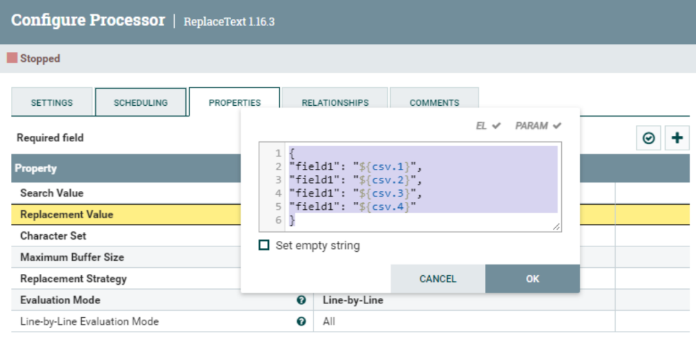
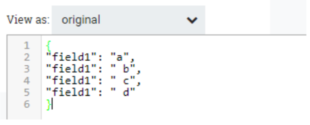
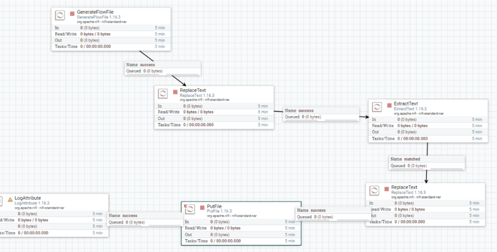
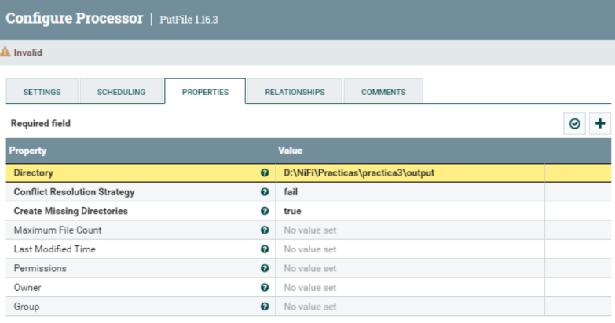
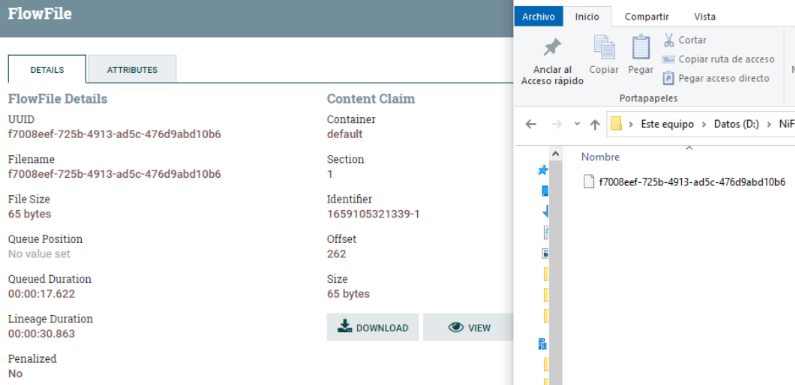
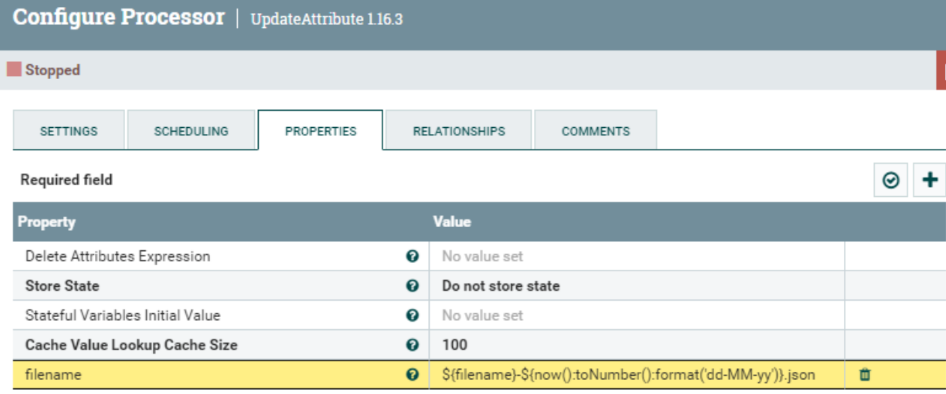
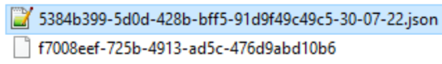
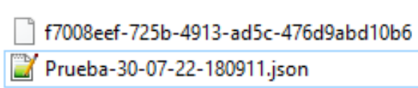

# NiFi Prácticas

## Práctica 3: Expression Language

Partimos del resultado de la anterior practica 2, trabajando con atributos y contenido dónde 
generaremos primero un fichero aleatorio o con contenido personalizado, le aplicaremos 
alguna transformación y luego alteraremos en este sus propiedades. También veremos por los 
diferentes estados que pasa la ejecución y cómo ver en cada punto como va evolucionando el 
proceso.

El objetivo de esta práctica es modificar la solución de la practica 2, añadiendo un paso más al 
final, dónde utilizando Expression Language NiFi extraeremos información de los atributos de 
FlowFile que hemos creado para introducirlas en el contenido en formato JSON. Teniendo 
como resultado algo similar:

        
        {
        "field1": "a",
        "field1": "b",
        "field1": "c",
        "field1": "d"
        }

 

Añadimos un nuevo ReplaceText mediante el botón de Processor o duplicamos el que 
ya teníamos configurado para tener la misma configuración. Y lo conectamos entre el 
Processor “ExtractText” y terminando en el “LogAttribute”

 

 Una vez en este punto, nos queda configurar el “ReplaceText” añadido o duplicado, 
con la misma configuración que el primero, pero con la diferencia que en la propiedad 
“ReplacementValue” introducimos con Expression Language NiFi de dónde va a 
obtener los datos y que estructura va a tener para substituir el anterior contenido con 
el nuevo. El código es el siguiente, dónde referenciamos con el carácter “$” que es una 
propiedad del FlowFile.

        {
        "field1": "${csv.1}",
        "field1": "${csv.2}",
        "field1": "${csv.3}",
        "field1": "${csv.4}"
        }

 

Ejecutamos y podemos ver en la cola el resultado del contenido, si ha funcionado 
correctamente debe salir algo similar a la siguiente imagen:

 

*Nota: El Expression Language NiFi es muy útil y existen muchas funciones que es posible 
utilizarlas. Para ello recomendamos visitar la siguiente documentación y dedicarle unos 
minutos: Apache NiFi Expression Language Guide*

Ahora vamos a continuar con el dataflow que hemos creado.
Si vamos a la cola final, y vemos los ficheros sus propiedades podemos ver que existen 
las propiedades de UID y Filename, que son valores únicos. Estos identifican de forma 
única el fichero dentro del dataflow y es posible utilizarlos para referenciar el FlowFile.
Por ejemplo, vamos a añadir un Processor “PutFile” y lo conectaremos entre el último 
replaceText y el log. Luego entraremos en las propiedades del PutFile y 
configuraremos el directorio dónde quedamos que se guarde el fichero.

 

 

Arrancamos todos los procesos para generar un fichero y que llegue hasta la cola del 
log y veamos que pasa en el directorio. Confirmamos que el nombre del fichero lo coge 
de la propiedad de Filename del FlowFile.

 

Vamos a añadir un Processor para actualizar el atributo y poner un nombre a los 
ficheros de salida (en la propiedad). El Processor a añadir es “*UpdateAttribute*”. Y 
vamos a propiedades y añadimos una nueva “*Filename*”. Y introducimos el valor 
siguiente:

        ${filename}-${now():toNumber():format('dd-MM-yy')}.json

 

Ya solo quedaría conectar el Processor antes del PutFile para que le dé tiempo a 
cambiarle la propiedad. Y volvamos a revisar la salida a ver qué pasa.

 

Hagamos como ejercicio, que el fichero de salida salga con el siguiente formato dónde 
lo siguiente a la fecha son horas, minutos y segundos:

**ENTREGABLE:** Hay que exportar la practica con un Processor Group que genera un .json y entregarlo en Aules con el número de la práctica y el nombreApellidos. Por ejemplo:  *P3_NomAlumnoApellidos.xml*