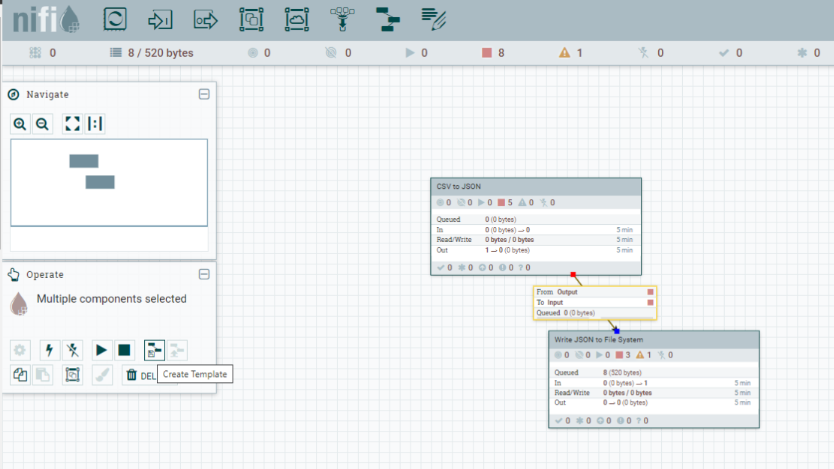
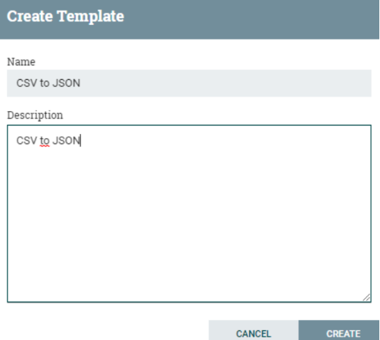
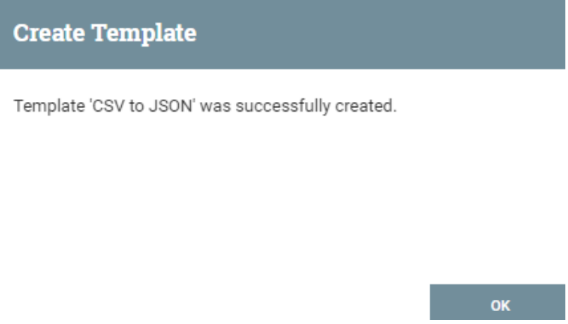
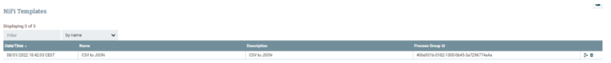
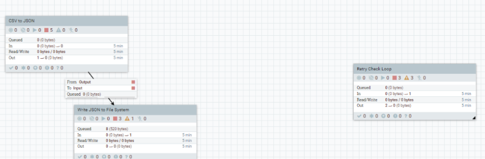
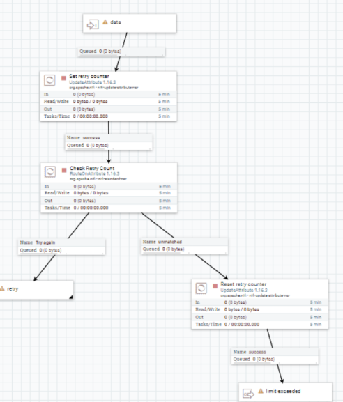

## Templates

       > Esta práctica queda descartada. Dado que en la versión M2 NiFi ya no se trabaja con los Templates si no con el Registry, exportando los trabajos a través de un Processor Group, pero si en versiones anteriores. Tenedlo en cuenta dado que si trabajais en versiones anteriores es la forma de guardar y exportar el trabajo realizado.
    
Para guardar el trabajo realizado, exportarlo, etc usaremos los “Templates”.
Para ello debemos seleccionar todos los componentes a guardar en el template, y 
buscar el icono crear template que encontrareis en la izquierda.

 

Le pondremos por ejemplo “*CSV to JSON*” y lo creamos.

 

Hacemos click en “*Create*”.

 

Este template se almacena en la instancia local.
Si queremos ver todos los templates que tenemos creados en nuestra instancia local, 
tenemos que ir al botón de la derecha arriba y hacer clic en “*Templates*” dónde 
saldrá un listado. Dónde a la derecha aparece los botones para descargarlos para 
una futura importación o copia de seguridad.

 

*Nota: Existen templates de ejemplo que podemos descargar e importar a nuestra instancia
local para practicar o utilizar para un desarrollo. Lo podéis encontrar en el siguiente enlace: 
https://cwiki.apache.org/confluence/display/nifi/example+dataflow+templates*

Vamos a acceder a la anterior página web y descargar un template. Por ejemplo, el 
“*Retry Count Loop*”.
Nos quedaría ahora importarlo a nuestro entorno de desarrollo. Accedemos al botón 
“*Upload Template*” y seleccionamos el fichero descargado “Retry_Count_Loop.xml” a 
través del icono .
Ahora para utilizarlo o revisar, sólo debemos ir a la barra de herramientas y 
seleccionar “*Add Template*” y arrastrar al espacio de trabajo. Seleccionamos el 
template descargado y veréis que aparece un nuevo Process Group.

 

El cual, si hacemos doble clic, nos aparecerán todos los processor que tiene este 
Process Group. 

**ENTREGABLE:** Hay que exportar la practica con un Processor Group que genera un .json y entregarlo en Aules con el número de la práctica y el nombreApellidos. Por ejemplo:  *P5_NomAlumnoApellidos.xml*

 