## Controller Services

Los Controller Services son servicios compartidos que pueden ser usados con los processor o con otros controller 
services.

Vamos a realizar el siguiente caso de uso para validar esta funcionalidad.

*NOTA: Para esta práctica es necesario tener una base de datos PostgreSQL disponible*

Añadimos un nuevo processor “*GeneratorFlowFile*”. Lo configuramos para que genere 
un fichero cada 10 segundos y en propiedades en el CustomText le ponemos lo 
siguiente:

```json
{
"title": "mr",
"first": "John ${random():mod(10):plus(1)}",
"last": "Doe ${random():mod(10):plus(1)}",
"email": "johndoe${random():mod(10):plus(1)}nail.com",
"created_on": "${now():toNumber()}"
}
```        

<div align="center">

</div>

<div align="center">
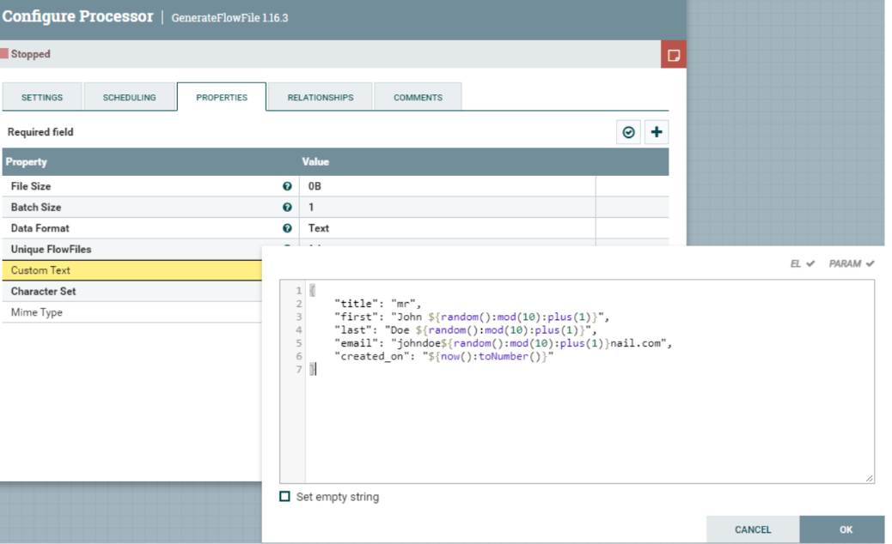
</div>

Añadimos un processor “LogAttribute” y conectamos el *FlowFileGenerator* al 
“*LogAttribute*”.

<div align="center">
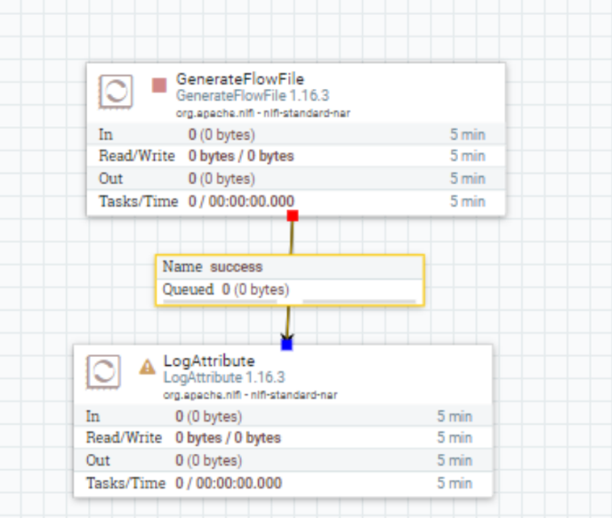
</div>

Ahora vamos a ejecutar el proceso y validar que funciona correctamente viendo el 
contenido del fichero generado

<div align="center">
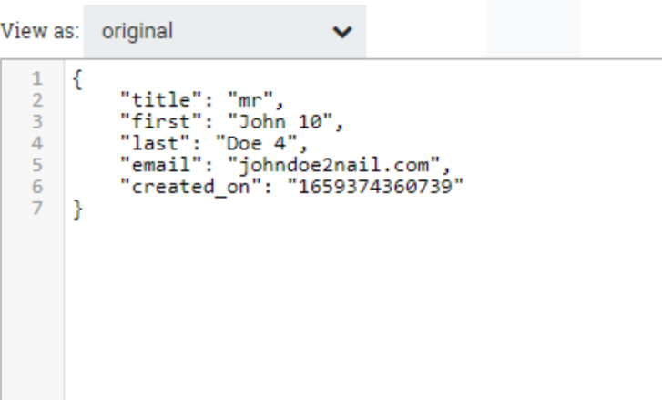
</div>

Añadimos un processor “*PutSQL*” para mandar este contenido generado a una 
tabla de base de datos.

*Nota: Necesitamos tener una base de datos simple para hacer esta práctica ya sea en local o 
remota, por ejemplo, un PostgreSQL.*

Para llegar a tener en formato SQL el contenido del JSON. Antes necesitamos 
convertirlo de formato. Para ello usaremos el processor *ConvertJSONToSQL*.

<div align="center">
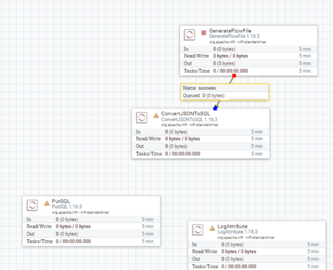
</div>

Vamos a configurar el processor *ConvertJSONToSQL*. Primero hay que configurar un 
nuevo *Controller Service*. De la siguiente manera:
        o Table Name: tbl_users
        o Statment Type: INSERT
        o JDBC Connection Pool: 

Aquí es necesario crear un nuevo *Controller Services* seleccionando 
“Create Controller Services” dónde en este caso vamos a seleccionar 
“*DBCPConnectionPool*”.

<div align="center">

</div>

Ahora faltaría configurar las propiedades de este *Controller Service*
que hemos creado para introducir los datos de la conexión a la base de 
datos. Haciendo clic en la flecha que sale a la derecha.

<div align="center">
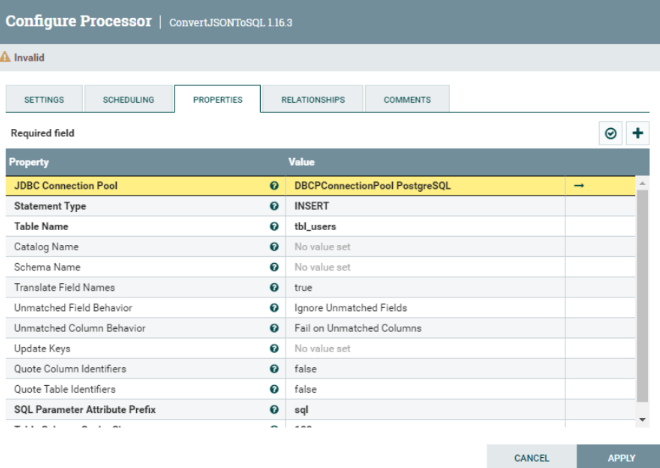
</div>

<div align="center">
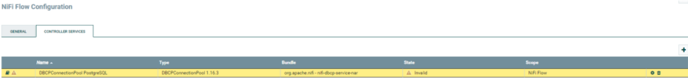
</div>

*Hacemos clic* en el botón de configuración y cuando salga la ventana vamos a 
propiedades y rellenamos las siguientes propiedades:

        o Connection URL: jdbc:postgresql://127.0.0.1:5432/postgres
        o Driver class name: org.postgresql.Driver
        o Driver Location: dónde tengamos el postgresql-42.2.25.jar 
        o Database User: xxxxxxxxxxx
        o Password: xxxxxxxxx

<div align="center">
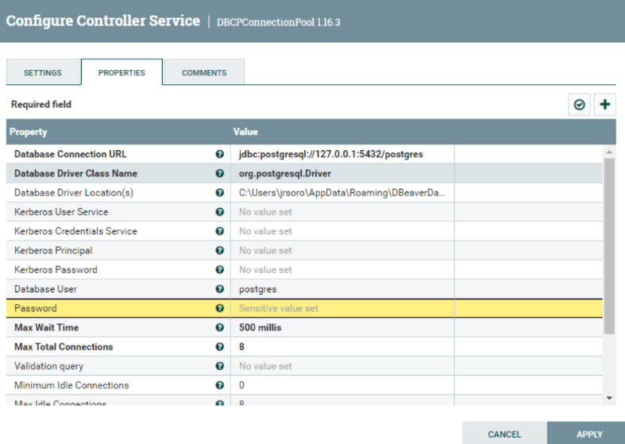
</div>

Aplicamos cambios y activamos la conexión

<div align="center">
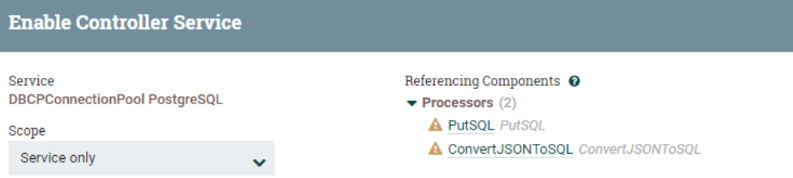
</div>

<div align="center">
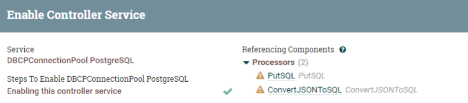
</div>

La estructura de la tabla destino es la siguiente

<div align="center">
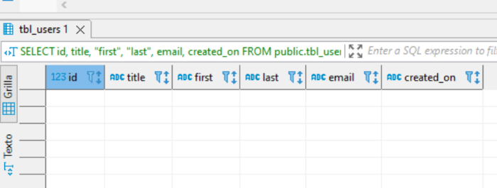
</div>

Volvemos al espacio de trabajo y conectamos el processor “*ConverJSONtoSQL*” al 
“*PutSQL*” y configuramos el tipo de relación que tendrán, en este caso “*sql*”

<div align="center">
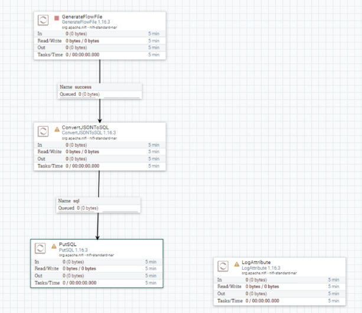
</div>

Pero también queremos mantener el fichero convertido, por tanto, añadiremos un 
nuevo proceso “*LogAttribute*” que conectaremos el “*ConvertJSONtoSQL*” a este y 
seleccionaremos la relación “*original*”. Esto nos valdrá de traza. También en el 
processor “*ConverJSONToSQL*” es necesario configurar la relación que cuando falle 
termine en ese punto.

<div align="center">

</div>

<div align="center">
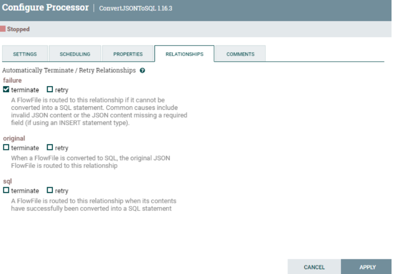
</div>

Y ejecutamos para ver qué es lo que hace en las dos colas. En una podemos ver el 
fichero original y en otra la traducción a una sentencia INSERT sql. Como podéis ver es 
necesario especificar los valores del insert a través de los atributos, como podéis ver 
en las siguientes imágenes ya que los valores del FlowFile generado (JSON) los deja en 
los atributos para que puedan ser usados

<div align="center">
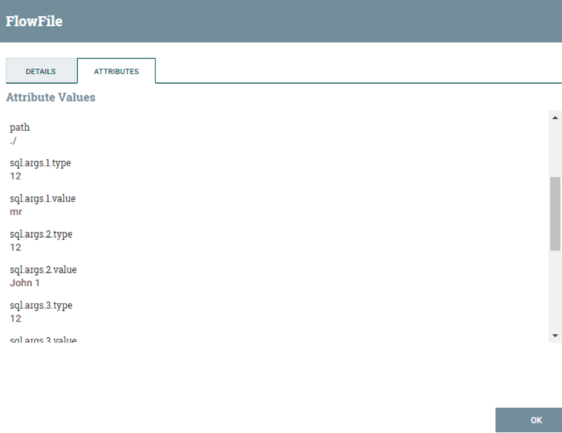
</div>

<div align="center">
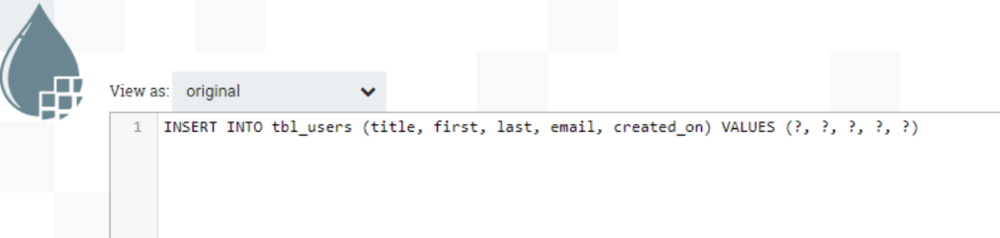
</div>

Nos queda ir al processor “*PutSQL*” y configurar que tenga bien puesto el jdbc 
(controller services) que hemos creado anteriormente.
Unir el processor “*PutSQL*” con el “*LogAttribute*” cuando tenga éxito.
Sobre el mismo connector “*PutSQL*” establecer una relación de que vuelva a intentarlo 
si falla “*Retry*”.

<div align="center">
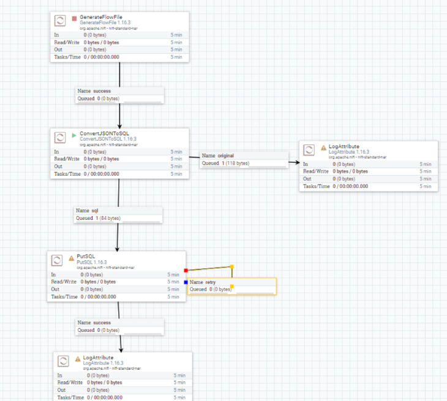
</div>

Activamos todo el workflow y validamos en las colas que todo funciona. Como última 
comprobación, revisamos la tabla de la base de datos y veamos que los datos se estén
insertando

<div align="center">
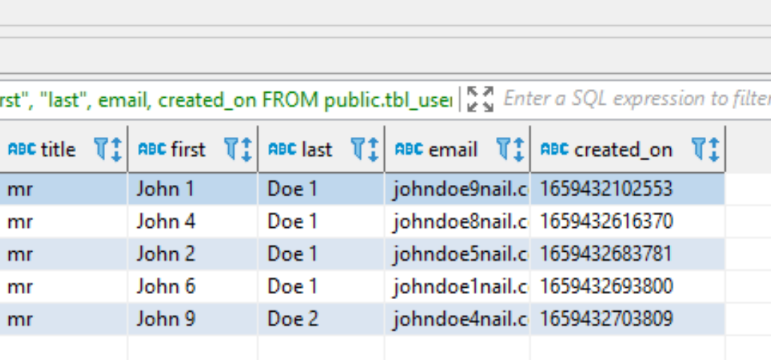
</div>

## ENTREGABLE 

Hay que exportar la practica con un Processor Group que genera un .json y entregarlo en Aules con el número de la práctica y el nombreApellidos. Por ejemplo:  *P7_NomAlumnoApellidos.xml*