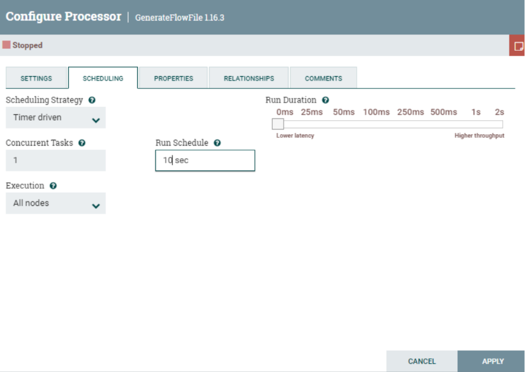
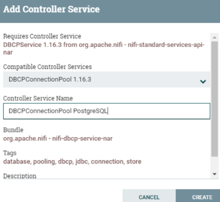
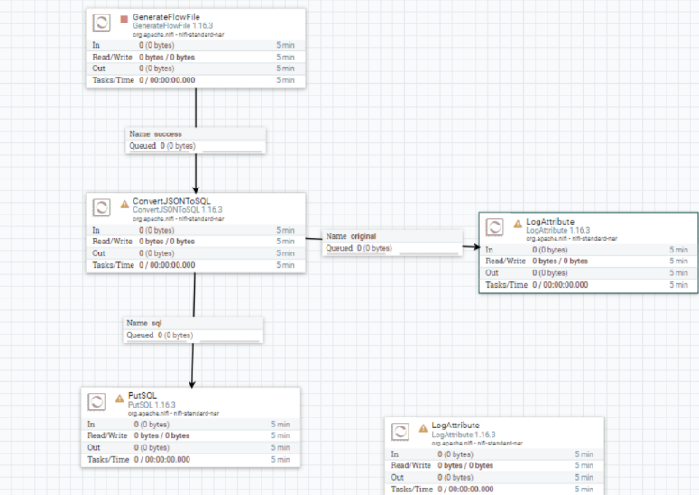

## Controller Services

Los Controller Services son servicios compartidos que pueden ser usados con los processor o con otros controller 
services.

Vamos a realizar el siguiente caso de uso para validar esta funcionalidad.

Añadimos un nuevo processor “*FlowFileGenerator*”. Lo configuramos para que genere 
un fichero cada 10 segundos y en propiedades en el CustomText le ponemos lo 
siguiente:

        {
        "title": "mr",
        "first": "John ${random():mod(10):plus(1)}",
        "last": "Doe ${random():mod(10):plus(1)}",
        "email": "johndoe${random():mod(10):plus(1)}nail.com",
        "created_on": "${now():toNumber()}"
        }

 

 

Añadimos un processor “LogAttribute” y conectamos el “*FlowFileGenerator*” al 
“*LogAttribute*”.

 

Ahora vamos a ejecutar el proceso y validar que funciona correctamente viendo el 
contenido del fichero generado

 

Añadimos un processor “*PutSQL*” para mandar este contenido generado a una 
tabla de base de datos.

*Nota: Necesitamos tener una base de datos simple para hacer esta práctica ya sea en local o 
remota, por ejemplo, un PostgreSQL.*

Para llegar a tener en formato SQL el contenido del JSON. Antes necesitamos 
convertirlo de formato. Para ello usaremos el processor “*ConvertJSONToSQL*”.

 

Vamos a configurar el processor “*ConvertJSONToSQL*”. Primero hay que configurar un 
nuevo “*Controller Service*”. De la siguiente manera:
        o Table Name: tbl_users
        o Statment Type: INSERT
        o JDBC Connection Pool: 

Aquí es necesario crear un nuevo “*Controller Services*” seleccionando 
“Create Controller Services” dónde en este caso vamos a seleccionar 
“*DBCPConnectionPool*”.

 

Ahora faltaría configurar las propiedades de este “*Controller Service*” 
que hemos creado para introducir los datos de la conexión a la base de 
datos. Haciendo clic en la flecha que sale a la derecha.

 

 

Hacemos clic en el botón de configuración y cuando salga la ventana vamos a 
propiedades y rellenamos las siguientes:

        o Connection URL: jdbc:postgresql://127.0.0.1:5432/postgres
        o Driver class name: org.postgresql.Driver
        o Driver Location: dónde tengamos el postgresql-42.2.25.jar 
        o Database User: xxxxxxxxxxx
        o Password: xxxxxxxxx

 

Aplicamos cambios y activamos la conexión

 

 

La estructura de la tabla destino es la siguiente

 

Volvemos al espacio de trabajo y conectamos el processor “*ConverJSONtoSQL*” al 
“*PutSQL*” y configuramos el tipo de relación que tendrán, en este caso “*sql*”

 

Pero también queremos mantener el fichero convertido, por tanto, añadiremos un 
nuevo proceso “*LogAttribute*” que conectaremos el “*ConvertJSONtoSQL*” a este y 
seleccionaremos la relación “*original*”. Esto nos valdrá de traza. También en el 
processor “*ConverJSONToSQL*” es necesario configurar la relación que cuando falle 
termine en ese punto.

 

 

Y ejecutamos para ver qué es lo que hace en las dos colas. En una podemos ver el 
fichero original y en otra la traducción a una sentencia INSERT sql. Como podéis ver es 
necesario especificar los valores del insert a través de los atributos, como podéis ver 
en las siguientes imágenes ya que los valores del FlowFile generado (JSON) los deja en 
los atributos para que puedan ser usados

 

 

Nos queda ir al processor “*PutSQL*” y configurar que tenga bien puesto el jdbc 
(controller services) que hemos creado anteriormente.
Unir el processor “*PutSQL*” con el “*LogAttribute*” cuando tenga éxito.
Sobre el mismo connector “*PutSQL*” establecer una relación de que vuelva a intentarlo 
si falla “*Retry*”.

 

Activamos todo el workflow y validamos en las colas que todo funciona. Como última 
comprobación, revisamos la tabla de la base de datos y veamos que los datos se estén
insertando

 

**ENTREGABLE:** Hay que exportar el template del proyecto y entregarlo en Aules con el número de la práctica y el nombreApellidos. Por ejemplo:  *P7_NomAlumnoApellidos.xml*