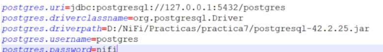
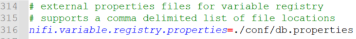
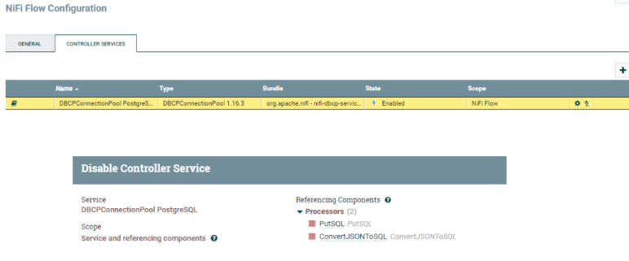
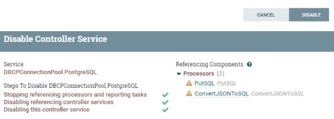
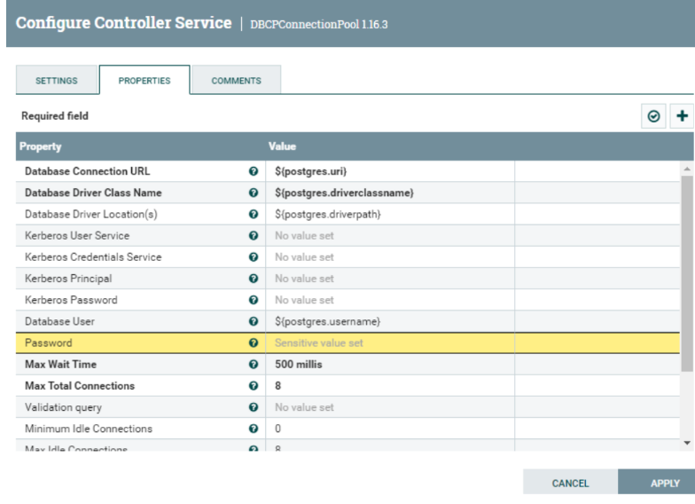
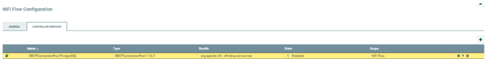
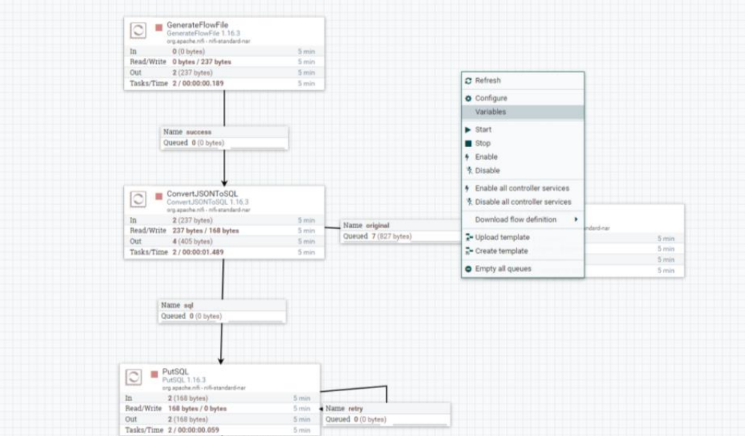
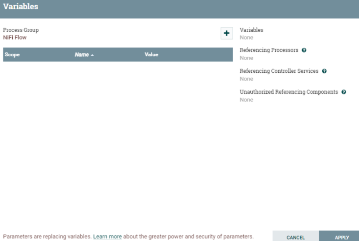

## Práctica 8: Variables
Las variables pueden ser usadas de dos formas:
En la ventana de la interfa de NiFi
En un fichero de configuración el cual referimos a través de “*nifi.propierties*”.
Vamos a crear un fichero de configuración llamado “*db.propierties*” y añadiremos 
todas las propiedades que en la practica 7 hemos usado para la configuración del 
Controller Service con la base de datos.

        o postgres.uri=jdbc:postgresql://127.0.0.1:5432/postgres
        o postgres.driverclassname=org.postgresql.Driver
        o postgres.driverpath= D:/NiFi/Practicas/practica7/postgresql-42.2.25.jar
        o postgres.username=postgres
        o postgres.password=nifi

<div align="center">

</div>

Ahora buscamos el fichero de configuración de NiFi llamado “*nifi.properties*” en el 
directorio “*conf*” y lo editamos. Búscamos “*registry*” y configuramos la variable que 
estará vacía en la ubicación del fichero que hemos creado “*db.properties*” que lo 
vamos a ubicar en el mismo directorio conf.

<div align="center">

</div>

*Nota: Si tenemos más de un fichero de configuración, lo pondríamos separado por “,”.*

Ahora para aplicar los cambios, es necesario reiniciar la instancia de NiFi. *Control + c* para cerrar la ventana de lanzamiento del proceso. Si se trata de sistema operativo 

```bash
```
Linux /nifi.sh stop , /nifi.sh start
```
<div align="center">

</div>

Una vez hemos vuelto a arrancar NiFi, nos vamos al processor ConvertJSONtoSQL, a 
propiedades y vamos con la flecha a la configuración del JDBC Connection Pool dónde 
debemos deshabilitar el Controller Service

<div align="center">

</div>

Ya deshabilitado, podemos ir a la configuración del Controller Service y vamos a usar 
Expression Language en las propiedades para especificar los parámetros definidos en 
el fichero que hemos cargado en el arranque de NiFi. Son los siguientes:

        o Database Connection URL: ${postgres.uri}
        o Database Driver Class Name: ${postgres.driverclassname}
        o Database Driver Location: ${postgres.driverpath}
        o Database User: ${postgres.username}
        o Database Password: ${postgres.password}

Aplicamos los cambios y volvemos a activar el Contoller Service para validar que 
funciona todo correctamente.

<div align="center">

</div>

<div align="center">

</div>

Ejecutamos y comprobamos que todos los pasos funcionan según lo esperado y que 
llegamos a insertar en la base de datos, por ejemplo, revisando la fecha de creación.
Cómo hemos comentado hay dos opciones de utilizar variables. Ya hemos visto la primera que es utilizando ficheros de propiedades que se cargan cuando arranca NiFi. Ahora vamos a ver la otra opción.

<div align="center">

</div>

Básicamente se hace en la hoja de trabajo, con botón derecho aparece la opción 
“*Variables*”. Hacemos clic y nos aparece una ventana para definirlas. Estas variables 
son definidas directamente.

<div align="center">

</div>

Se referencian de la misma manera que las que se cargan con NiFi. 

*Nota: Es más ventajoso usar las variables definidas directamente ya que no necesitan 
reiniciar NiFi, además que ayuda a corregir posibles errores de manera rápida y también evitarlos.*

## ENTREGABLE 

Hay que exportar la practica con un Processor Group que genera un .json y entregarlo en Aules con el número de la práctica y el nombreApellidos. Por ejemplo:  *P8_NomAlumnoApellidos.xml*