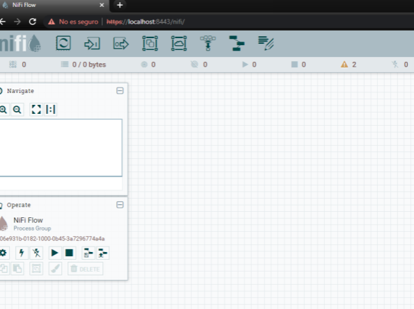
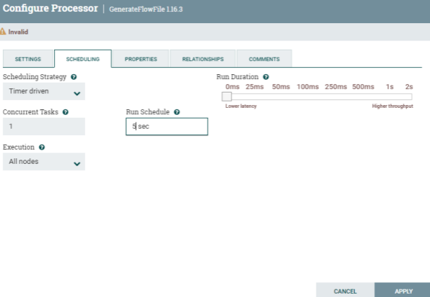
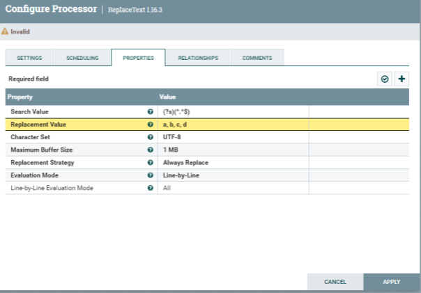
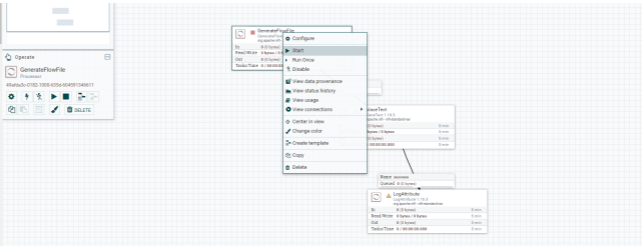
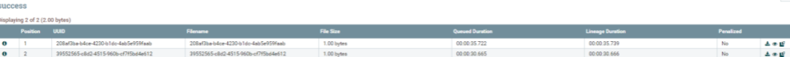
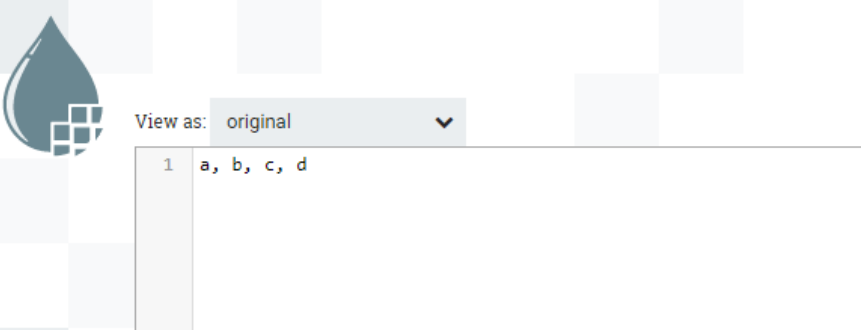
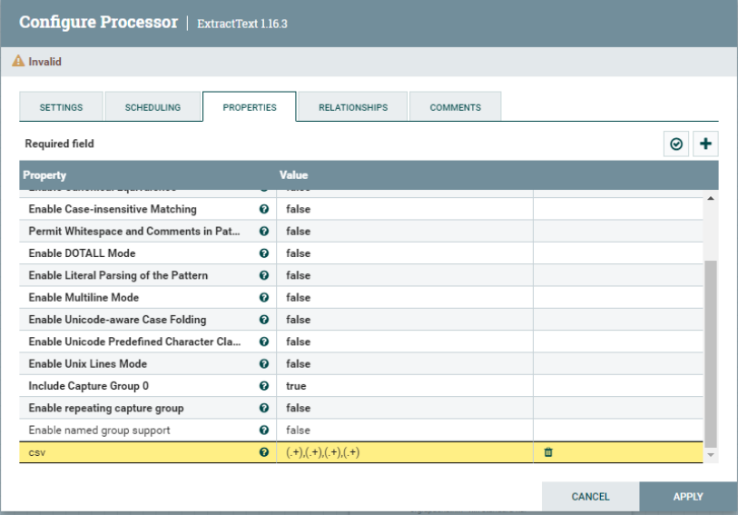
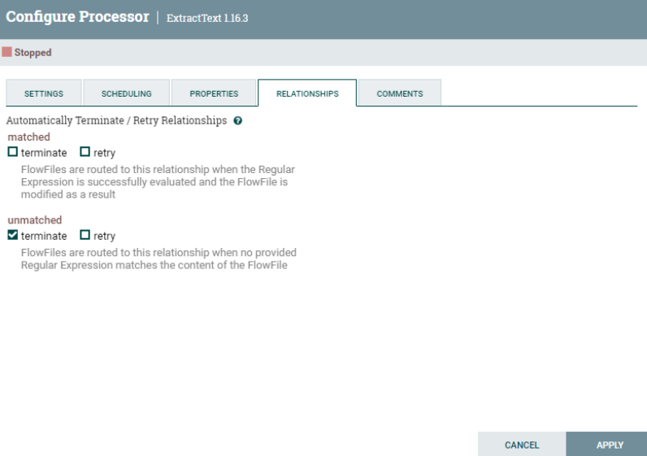

# NiFi Prácticas

## Práctica 1: Mover un fichero de un origen a un destino

**Iniciamos** NiFi. Ejecutamos:

        ./bin/nifi.sh start (Unix)
        ./bin/nifi.bat start (MSDOS)

**Accedemos** a la siguiente url que se levantará en el ordenador (*o la que indica el 
Readme, según la versión funcionara una u otra*): 

[https://localhost:8443/nifi/](https://localhost:8443/nifi/)

  

**Pedirá unas credenciales**. Podemos utilizar las creadas de manera automática 
al arrancar por primera vez en el fichero de logs que podréis encontrar en: *logs/nifiapp.log*. Lo encontrareis buscando la siguiente palabra clave: *Username*

Una vez hayamos hecho login, nos aparecerá la interfaz de trabajo.

  

En la **barra de iconos de herramientas**, hacemos clic en “*Processor*” y arrastramos 
hacia el área de trabajo

 

En la ventana de “*Add Processor*” búscamos *getFile*. Y hacemos clic en “*Add*”.

 

Repetimos el mismo proceso para añadir el processor “*putFile*”. Quedando algo similar 
a la siguiente imagen.

 

Ahora, vamos a **configurar** de dónde vamos a coger el fichero *origen* y dónde lo vamos 
a dejar en el *destino*. 

**Hacemos clic** botón derecho en “*GetFile*” en “*Configure*” y vamos a la pestaña 
“*Properties*”. Dónde podemos ver los diferentes aspectos que son configurables. 
Ahora mismo sólo vamos a indicar el directorio de entrada “*Input Directory*”.

 

Hacemos clic botón derecho en “*PutFile*” en “*Configure*” y vamos a la pestaña 
“*Properties*”. Dónde podemos ver los diferentes aspectos que son configurables. 
Ahora mismo sólo vamos a indicar el directorio de entrada “*Directory*”.

 

Ya configurado el componente del origen de los ficheros y el destino, sólo nos queda 
unirlos. Si hacemos clic sobre el componente “*GetFile*” veremos una flecha que nos 
permitirá arrastrarla hasta el otro componente “*PutFile*”. Quedando como la siguiente 
imagen:

 

Ahora nos queda probar que traslada correctamente los ficheros, arrancando los dos 
componentes con botón derecho y hacer clic en “*Start*”. En los dos componentes. 
Primero el “*GetFile*” y luego el “*PutFile*”.

 

Si al realizar la acción no sale la opción en el “*PutFile*” lo que hay que hacer es entrar 
en este componente en propiedades e indicarle que acción debe hacer en el caso de 
que falle

 

Una vez todo configurado y en estado “*Start*” veréis que empieza a mover el fichero 
del origen configurado al destino. Marcado con verde como que se ha ejecutado 
correctamente

 

**ENTREGABLE:** Hay que exportar la practica con un Processor Group que genera un .json y entregarlo en Aules con el número de la práctica y el nombreApellidos. Por ejemplo:  *P1_NomAlumnoApellidos.xml*

## Práctica 2: Atributos y contenido

Generaremos primero un fichero aleatorio o con contenido personalizado, le aplicaremos 
alguna transformación y luego alteraremos en este sus propiedades. También veremos por los 
diferentes estados que pasa la ejecución y cómo ver en cada punto como va evolucionando el 
proceso.

Una vez hayamos hecho login, nos aparecerá la interfaz de trabajo

 

En la barra de iconos de herramientas, hacemos clic en “*Processor*” y arrastramos 
hacia el área de trabajo.

 

En la ventana de “*Add Processor*” búscamos “*GenerateFlowFile*”. Y hacemos clic en 
“*Add*”.

Nota: Este processor crea FlowFiles con datos aleatorios o contenido personalizado

 

Ahora, vamos a configurarlo con datos aleatorios conforme la siguiente imagen. Y 
planificarlo.

 

 

Ahora vamos a añadir a la hoja de trabajo, otro processor llamado “*Replace Text 
Processor*”

Nota: bajo cada processor encontraremos una breve descripción de la funcionalidad

 

Establecemos la conexión entre los dos processor antes de configurar el ReplaceText.

 

Le dedicamos unos minutos a entender el processor “*ReplaceText*” que propiedades 
nos aporta. 
Nota: Es recomendable revisar siempre antes de usar las propiedades disponibles y si 
es necesario, realizar alguna pequeña prueba.

 

Queremos remplazar en el contenido del fichero generado por unos valores separados 
por comas. Y guardamos

 

Para visualizar que es lo que pasa, vamos a añadir un processor “*log attribute*” y 
conectarlo sobre el processor “*ReplaceText*”. En esta conexión, debemos activar la 
casilla “*success*”.

 

Vamos a probar la generación del fichero y transformación de este. Le damos a “*Start*” 
con botón derecho sobre el processor “*GenerateFlowFile*”. Veremos que genera un 
fichero en la cola. Una vez lo genere, vamos a pararlo de la misma manera con la 
acción “*Stop*”. Ya que, si recordamos, lo hemos planificado para que se ejecute cada 5 
segundos. Si no, estará generando cada 5 segundos un nuevo fichero.

 

En la cola, podemos validar el contenido generado, con botón derecho, “*List queue*”. Si 
damos al primer botón (columna), podremos ver/descargar el fichero generado.

 

Si el processor os pone una alerta y no os deja arrancarlo. Es debido a que necesita 
que especifiquemos que hacer cuando falle. Cuando tenga éxito ira al processor 
conectado, pero cuando falle, que acción debe hacer. Vamos a propiedades, a 
relaciones y ahí lo podemos configurar

 

Ahora ya le podemos dar la acción “Start” y ver que hace el “ReplaceText” que le 
hemos indicado al fichero de la cola. Podemos ir a la cola y validar que los ficheros se 
han convertido conforme lo esperado.

 

 

Ahora vamos a añadir el processor “*ExtractText*” y en propiedades de este 
configuramos una nueva propiedad “*csv*” con una expresión regular “*(.+),(.+),(.+),(.+)*” 
de la siguiente manera:

 

Ahora conectamos el “*ReplaceText*” con “*ExtractText*” eliminando la anterior relación 
con “*LogAttribute*”. Y luego, conectamos “*ExtractText*” con “*LogAttribute*”. En la 
definición de la relación, se ha de marcar el check “matched”. Como veis, el processor 
ExtractText tiene una alerta amarilla, quiere decir que no está del todo bien 
configurado. Pasa lo mismo que antes, es necesario añadir cuando la acción contraria a 
“match” que tiene que hacer. 
Vamos a propiedades de “*ExtractText*”, a “*Relationships*” y marcamos la acción 
“*terminate*”.

 

 

Llegado a este punto, le damos a la acción “*start*” del processor “*ExtractText*” y vemos 
como procesa el fichero con una salida en la cola. Podemos ver el resultado en la cola 
de nuevo como ha generado nuevos atributos según la expresión regular que le hemos 
aplicado, ya que el contenido en este caso no se ha visto modificado.

 

**ENTREGABLE:** Hay que exportar la practica con un Processor Group que genera un .json y entregarlo en Aules con el número de la práctica y el nombreApellidos. Por ejemplo:  *P2_NomAlumnoApellidos.xml*