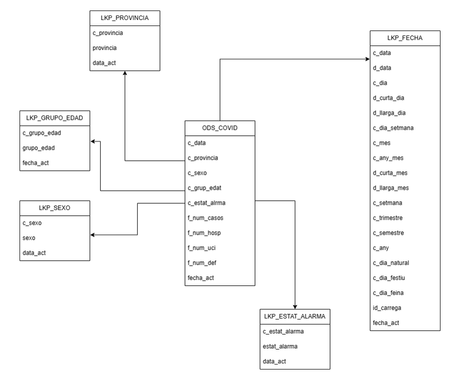
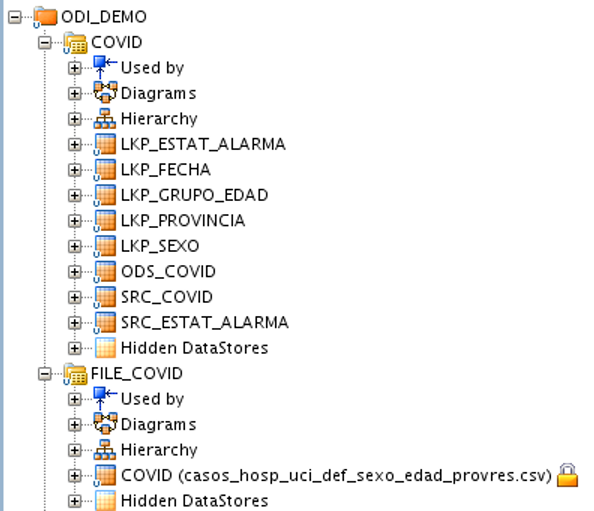

# Case de uso

## Enunciado

El **Centro Nacional de Epidemiología** ha habilitado una sección específica en su página web para proporcionar información detallada sobre la evolución de la epidemia de la Covid-19 desde 2020. Esta plataforma no solo presenta informes y conclusiones internas, sino también acceso a las fuentes originales de datos que los respaldan. La documentación y los conjuntos de datos están disponibles en: [CNE Covid](https://cnecovid.isciii.es/covid19/#documentaci%C3%B3n-y-datos).

En aproximadamente 4 sesiones, trabajaremos en nuestro caso de uso utilizando esta información. El proceso incluirá un proceso ETL con Oracle Data Integrator (ODI), seguido de la creación de un modelo multidimensional para almacenar los datos de manera eficiente en una base de datos analítica. Finalmente, realizaremos un análisis detallado con herramientas de generación de informes para explorar y explotar los datos analizados.

La visualización se realizará en etapas posteriores, con el objetivo de crear un diseño similar al de PowerBI presentado en la misma página web, para facilitar la comprensión e interpretación de los datos sobre la Covid-19.

### Requisitos

Se deben crear las siguientes dimensiones:

- **Sexo**  
Esta dimensión se creará a partir de los datos proporcionados en el archivo fuente histórico del Covid (cogiendo los diferentes tipos de valores para el código Sexo). La variable "Sexo" representará el género de las personas afectadas por la epidemia de la Covid-19, permitiendo segmentar los casos, hospitalizaciones, ingresos en UCI y defunciones según este atributo.

- **Grupo de Edad**  
La dimensión "Grupo de Edad" se creará utilizando los datos del archivo fuente histórico del Covid (cogiendo los diferentes tipos de valores para el código Grupo Edad). Los grupos de edad se dividirán en categorías relevantes, como pueden ser menores de 18 años, 18-40 años, 41-60 años, 61-80 años, y mayores de 80 años. Esto permitirá analizar la distribución de los casos y otros eventos en función de la edad de los afectados.

- **Provincia**  
Esta dimensión se generará a partir del archivo de provincias, que contiene los códigos y nombres de las provincias. La dimensión de **Provincia** permitirá segmentar los datos según la ubicación geográfica de los afectados, facilitando el análisis regional de la epidemia.

- **Fecha**  
La dimensión fecha se establecerá mediante un procedimiento SQL, donde se representarán los eventos en función del tiempo. Esta dimensión se utilizará para organizar y analizar los datos epidemiológicos en función de fechas específicas, lo que facilitará el análisis a lo largo del tiempo.

- **Estado de Alarma**  
Además de las dimensiones anteriores, es necesario generar un catálogo para analizar la cantidad de personas que estuvieron afectadas o no por la Covid-19 durante los períodos de estado de alarma. Este catálogo incluirá los siguientes estados:

       1. Declaración del estado de alarma desde el 14 de marzo: Representa el inicio del estado de alarma en España debido a la pandemia.

       2. Prórroga del estado de alarma desde el 27 de marzo: Refleja la extensión del estado de alarma inicial.

       3. Prórroga del estado de alarma desde el 10 de abril: Otra extensión del estado de alarma.

       4. Prórroga del estado de alarma desde el 24 de abril: Continuación del estado de alarma.

       5. Prórroga del estado de alarma desde el 8 de mayo: Nueva extensión del estado de alarma.

       6. Prórroga del estado de alarma desde el 22 de mayo: Continuación del periodo de alarma.

       7. Prórroga del estado de alarma desde el 5 de junio: Última prórroga del estado de alarma antes de su fin.

      99. Fuera del estado de alarma: Indica los casos fuera de los períodos de estado de alarma.

### Objetivo
El objetivo final de este proceso es que respecto a la información recibida se pueda interpretar y analizar:

- El **número de casos**, el **número de hospitalizaciones**, el **número de ingresos en UCI** y el **número de defunciones** de manera **diaria**.
- Determinar si las personas han sido afectadas en alguno de los **períodos de estado de alarma** mencionados anteriormente, lo que permitirá hacer un análisis detallado sobre el impacto de las diferentes fases del estado de alarma en los casos de Covid-19.

## Recursos

### Ficheros
-     **Histórico Covid**. El archivo contiene información detallada sobre la evolución de la pandemia de Covid-19 hasta el 28 de marzo de 2022. El archivo incluye datos sobre el número de casos confirmados, hospitalizaciones, ingresos en unidades de cuidados intensivos (UCI) y defunciones, segmentados por **sexo**, **edad** y **provincia de residencia**. Los datos abarcan todas las edades desde el inicio de la pandemia.
      -  <a href="../../assets/casos_hosp_uci_def_sexo_edad_provres.csv">Descarga histórico COVID-19</a>

- **Provincias**: Códigos de las provincias en España. Al descargar los códigos en formato CSV, se ha encontrado un problema de **codificación de caracteres** que debe resolverse durante el proceso de ETL.
      -  <a href="../../assets/provincies.csv">Descargar ISO 3166</a>

-  **Fechas**: Consulta SQL para generar de forma dinámica el catálogo de fechas. 
      -  <a href="../../assets/Proc Data Cataleg.sql">Descargar SQL</a>

- **Tramos estado alarma**: Representa los diferentes tramos por los que se pasa en el estado de alarma para poder clasificarlos y agruparlos.
       -  <a href="../../assets/trams.csv">Descargar tramos</a>

### Diagramas

#### Catalogos
Se representa un ejemplo de como cargar el fichero Covid por las diferentes capas des de que es un fichero (fuente del dato)  hasta que llega a la tabla final, de dónde se obtiene la tabla de catalogo de Sexo y Grupo Edad.

La fecha es un PLSQL que se carga con un procedimiento de ODI directamente a la tabla final que es el catalogo de fecha.

Las provincias se cargan a través del fichero ISO, se realizan las transformaciones pertinentes y luego se carga a la tabla final de Provincia. 

#### Multidimensional
Se representan la estrella como eje central y luego alrededor los diferentes catálogos que representan y detallan la información de análisis. 

#### Modelos
Un ejemplo de como se quedará el modelo de datos lógico de ODI en vuestro proyecto. Dónde vemos el modeo FILE_COVID es dónde se encuentran los ficheros definidos del COVID y el resto son las tablas Oracle. Se clasifican los modelos por tecnología. 

## Obtener y generar modelo multidimensional
Se prescinde de la creación de un documento formal de Análisis Funcional y Diseño. Sin embargo, se considera esencial establecer una visión clara sobre la construcción del modelo de datos. Este modelo se basará en las necesidades específicas del informe final y en los conocimientos adquiridos a lo largo del curso. A continuación, se detallan los requisitos esenciales para esta etapa:

### 1. **Modelo de datos**
Es necesario identificar las entidades clave relacionadas con la epidemia de la Covid-19. Estas entidades podrían incluir casos, hospitalizaciones, ingresos en UCI, defunciones, sexo, edad, provincia, entre otras.

Una vez identificadas las entidades, se debe definir cómo se relacionan entre sí para asegurar que la base de datos tenga una estructura lógica y eficiente.

### 2. **Variables y atributos**
Es importante definir claramente las variables y los atributos necesarios para capturar toda la información relevante relacionada con la epidemia. Esto podría incluir variables como el número de casos, el número de hospitalizaciones, la distribución por edades y sexos, etc.
   
Cada atributo debe estar bien etiquetado (*claridad en la etiquetación de atributos*) y debe ser representativo de la información. Esto garantiza que los datos sean comprensibles y útiles para su posterior análisis.

### 3. **Jerarquías temporales**
Es necesario crear jerarquías temporales para representar correctamente la secuencia de los eventos relacionados con la epidemia. Estas jerarquías pueden incluir, por ejemplo, años, meses, semanas y días, permitiendo así un análisis detallado de la evolución de la pandemia a lo largo del tiempo.

### 4. **Normativas y restricciones**
Se deben tener en cuenta todas las normativas o restricciones específicas asociadas con la recopilación y el uso de las datos epidemiológicos. Esto puede incluir regulaciones sobre la protección de datos personales, el acceso a la información, y las políticas de confidencialidad y privacidad.

### 5. **Metodología ETL**
Es fundamental planificar y describir detalladamente la metodología ETL que se seguirá para integrar los datos desde su origen hasta la base de datos analítica. Este proceso garantizará que los datos se extraigan correctamente de las fuentes originales, se transformen según las necesidades del análisis y se carguen adecuadamente en la base de datos final.

## ETL

### Capa SOURCE (SRC)
-       Cargar fichero COVID
-       Cargar ficheros propios para generar los catálogos
-       Generar procedimiento ODI para el catálogo de fecha
-       Generar proceso / paquete de carga SRC

**Pasos en ODI**

1. Hacer ingenieria inversa de los ficheros para obtener su estructura.

2. Desarrollar las ETL para cargar los ficheros a las tabla creadas previamente SRC.

3. Generar paquete con la carga de todas las ETL y procedimiento en SRC. WF_SRC_XXX

!!!   Ayuda (tablas SRC a crear):
      -     SRC_COVID
      -     SRC_PROVINCIA
      -     SRC_ESTAT_ALARMA

### Capa CATÁLOGOS (LKP)
-       Extraer de la tabla SRC COVID los catálogos necesarios.
-       Cargar del resto de tablas SRC los catálogos LKP.
-       Generar proceso / paquete de carga LKP.

**Pasos a ODI**

1. Crear tablas de los catálogos (LKP). Realizar ingeniería inversa de estas tablas.

2. Desarrollar las ETLs para cargar de las tablas SRC a las tablas de catálogo LKP.

3. Generar paquete con la carga de todas las ETL para Catálogos LKP (LKP).

!!!   Ayuda (tablas LKP a crear):

      -     LKP_SEXO
      -     LKP_GRUPO_EDAD
      -     LKP_PROVINCIA
      -     LKP_ESTAT_ALARMA
      -     LKP_FECHA

### Capa ESTRELLA, HECHOS (ODS)
- Extraer de la tabla SRC COVID los datos históricos/transaccionales.
- Extraer solo los códigos, no las descripciones.
- Generar lookups en el mapeo de ODS.
- Generar proceso/paquete de carga ODS.

**Pasos a ODI**

1.      Crear tabla histórica/transaccional (ODS). Realizar ingeniería inversa de esta tabla.

2.      Desarrollar la ETL para cargar de las tablas SRC a ODS.

3.      Utilizar los lookups para validar y cargar la información de los catálogos.

4.      Generar paquete con la carga del (ODS).

!!!   Ayuda (tabla ODS a crear):

      -     ODS_COVID

### Proceso final

**Pasos a ODI**

1.      Generar paquete que cargue de una vez todas las capas: SRC, LKP y ODS.

2.      Validamos que no haya errores.

3.      Validamos que las tablas dades de taules:

   - Que tinguin dades i siguin correctes

   - Que apleguen totes les dades que hi ha als fitxers: conteig al fitxer, src i ods.

   - Que estan amb el format que es vol representar
## Visualización y respresentación con Power BI

1. **Conexión directa con el modelo multidimensional**
      -  Power BI permite conectarse directamente a bases de datos como Oracle, SQL Server, entre otras. Si la conexión con la máquina virtual es exitosa, se podrá importar directamente el modelo multidimensional desde la base de datos, lo que facilitará la carga de datos en Power BI. En este caso, los datos estarán organizados en tablas de hechos y dimensiones que pueden ser fácilmente visualizadas y analizadas.

2. **En caso de no conseguir la conectividad**:
      -  Si existen problemas técnicos para conectar Power BI con la base de datos, la alternativa será **exportar el modelo multidimensional** a archivos de texto (por ejemplo, archivos CSV o Excel). Estos archivos deben contener toda la información relevante, organizados por las diferentes dimensiones y hechos definidos en el modelo.

      -  Luego, se importarán estos archivos en Power BI, donde se pueden definir relaciones entre las diferentes tablas de datos (por ejemplo, entre las tablas de hechos y dimensiones) para crear el modelo de datos en Power BI. Posteriormente, se podrán crear visualizaciones y análisis basados en esos datos.

3. **Generación del informe final**:
      -  Con el modelo multidimensional leído y cargado en Power BI (ya sea de manera directa o importando los archivos), se procederá a **crear las visualizaciones** que respondan a las necesidades del informe final. Esto incluirá gráficos, tablas y otras representaciones visuales que permitan explorar las diferentes métricas y dimensiones de los datos (por ejemplo, número de casos, hospitalizaciones, ingresos en UCI, defunciones, etc.).

      - También se podrán implementar **filtros y segmentaciones** basadas en dimensiones como la edad, el sexo, la provincia, etc., para que los usuarios del informe puedan analizar los datos de manera más flexible y detallada.

## Resumen

Una vez descargada la máquina virtual con todo el entorno preparado, se deben aplicar los conocimientos adquiridos durante el curso y desarrollar el análisis y diseño realizado en los pasos anteriores. El objetivo es **crear un modelo de base de datos multidimensional por capas** utilizando la base de datos Oracle en la máquina virtual proporcionada. El proceso se desglosa en los siguientes pasos:

1. **Crear tablas que carguen los archivos al BI (SRC_XXX)**
      - Se deben crear las **tablas de origen** que cargarán los archivos de datos en el sistema de **Business Intelligence (BI)**. Estas tablas se denominan **SRC_XXX**. Su función es almacenar los datos procedentes de diversas fuentes antes de que sean procesados y transformados. Asegurar la correcta carga y organización de los datos es esencial para que el sistema de BI pueda realizar los análisis de manera eficiente y precisa.

2. **Crear tablas de catálogos que carguen los archivos de la capa SRC_XXX a la capa LKP_XXX**
      - A continuación, se deben crear las **tablas de catálogos** que gestionan el proceso de **transformación** de los datos. Estas tablas cargan los datos de la capa **SRC_XXX** a la capa **LKP_XXX** (capa de búsqueda o lookup). En esta capa, los datos provenientes de los archivos se transforman para ser normalizados o enriquecidos con valores adicionales, como claves de referencia, descripciones o códigos. Esto garantiza la consistencia y la integridad de los datos a lo largo de las diferentes etapas del proceso.

      - Se debe incluir un **diagrama multidimensional de la extracción** como anexo, que representará visualmente cómo se mueven y transforman los datos entre las diferentes capas y cómo se estructuran las tablas dentro de cada capa.

3. **Crear tabla referente a la estrella que carga de las tablas SRC_XXX a la capa ODS_XXX**
      - El siguiente paso implica la creación de una **tabla estrella** que cargue los datos desde las tablas **SRC_XXX** a la capa **ODS_XXX** (almacén de datos operacionales). En esta capa, los datos se consolidan y se almacenan para facilitar su análisis. En el modelo estrella, las tablas de hechos y dimensiones están organizadas de manera que facilitan las consultas rápidas y eficientes. La tabla estrella es crucial porque organiza la información de manera que permite un análisis multidimensional, ofreciendo una visión completa de los datos según varias dimensiones.

      - En este paso, se debe incluir un **diagrama multidimensional de la estrella** como anexo, que mostrará cómo las tablas de hechos y dimensiones se relacionan dentro del modelo estrella.

4. **Crear la ingesta de datos con ETL usando ODI según la solución analizada**
      - Se debe crear el proceso de **ingesta de datos** usando **ETL**. Utilizando **Oracle Data Integrator (ODI)**, extraemos los datos de las fuentes originales y los almacenamos en tablas con las transformaciones pertinentes *SRC_XXX*, luego se obtienen también los catálogos *LKP_XXX* y definitivamente generamos la tabla estrella que contiene todo el histórico *ODS_XXX*. 

      - El proceso ETL es crucial para garantizar que los datos se carguen correctamente en el sistema de datos multidimensional. ODI facilitará la automatización de este proceso, permitiendo transformar los datos de manera eficiente y almacenarlos de forma estructurada.

5. **WF_XXX**
      - Finalmente, se hace referencia a la creación de **WF_XXX** asociado al proceso de integración de datos. Este flujo de trabajo es un conjunto de tareas o pasos definidos que se ejecutan en un orden específico para asegurar que el proceso ETL se complete correctamente. El workflow puede incluir tareas como validación de datos, ejecución de transformaciones y carga final de los datos. Con lo que añadiremos de forma secuencial todos los objetos creados. 