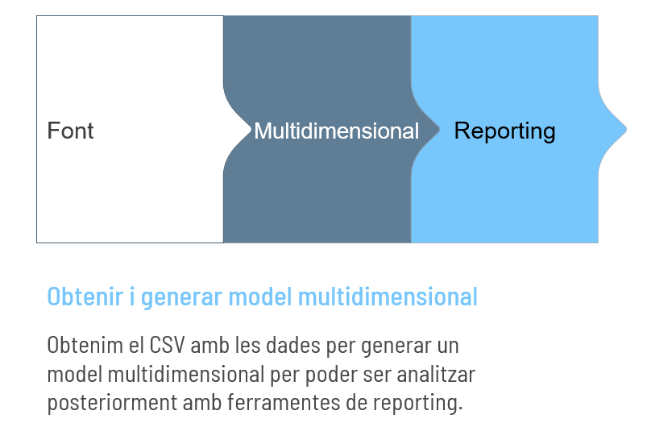

# Case de uso

## Obtener y generar modelo multidimensional

-       Obtenim el CSV amb les dades per generar un model multidimensional per poder ser analitzar posteriorment amb ferramentes de reporting.

## Análisis y modelo de datos

-       Analitzar i identificar els requeriments

-       Dissenyar el model multidimensional a construir. Implementar aquest model amb una ferramenta de Disseny, per exemple: Draw.io

1.      Identificar catàlegs i com obtindre la seva informació:
                Fitxer propi: Províncies, trams Covid
                Consulta sql / procediment: Data
                Fitxer Covid: Covid
2.      Identificar col.lectius / eixos d’anàlisi / catàlegs a analitzar
3.      Identificar la taula de fets / estrela.

## ETL

### Capa SOURCE (SRC):
-       Carregar fitxer COVID
-       Carregar fitxers propis dels catàlegs
-       Generar procediment ODI amb sql per catàleg temporal: Data
-       Generar procés/paquet de càrrega SRC

Pasos a ODI

1.      Fer enginyeria inversa dels fitxers.
2.      Desenvolupar les ETLs per carregar els fitxers/procediments a les taules Source (SRC). Crear les taules SRC.
3.      Generar paquet amb la càrrega de totes les ETL per al Source (SRC).

### Capa CATÀLEGS (LKP):
-       Extreure de la taula SRC COVID els catàlegs necessaris
-       Carregar de la resta de taules SRC els catàlegs
-       Generar procés/paquet de càrrega LKP

Pasos a ODI

1.      Crear taules dels catàlegs (LKP). Fer enginyeria inversa d’aquestes taules.
2.      Desenvolupar les ETLs per carregar de les taules SRC a les taules de catàleg LKP.
3.      Generar paquet amb la càrrega de totes les ETL per a Catàlegs LKP (LKP).

### Capa ESTRELA, FETS (ODS)
-       Extreure de la taula SRC COVID les dades històriques/transaccionals
-       Extreure sol els codis, no les descripcions.
-       Generar lookups en el mapping de ODS.
-       Generar procés/paquet de càrrega ODS

Pasos a ODI
1.      Crear taula històrica/transaccional (ODS). Fer enginyeria inversa d’aquesta taula.
2.      Desenvolupar la ETL per carregar de les taules SRC a ODS.
3.      Utilitzar els lookups per validar i carregar la informació dels catàlegs
4.      Generar paquet amb la càrrega del  (ODS).

### Final

1.      Generar paquet que carregue d’un cop: SRC, LKP i ODS.
2.      Validar que no hi hagi cap error
3.      Validar dades de taules:
        3.1.    Que tinguin dades i siguin correctes
        3.2.    Que apleguen totes les dades que hi ha als fitxers: conteig al fitxer, src i ods.
        3.3.    Que estan amb el format que es vol representar

