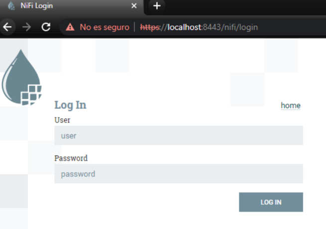

# ODI DEMO

**Iniciamos** NiFi. Ejecutamos:

        ./bin/nifi.sh start (Unix)
        
        ./bin/nifi.bat start (MSDOS)

**Accedemos** a la siguiente url que se levantará en el ordenador (*o la que indica el 
Readme, según la versión funcionara una u otra*): 

[https://localhost:8443/nifi/](https://localhost:8443/nifi/)

