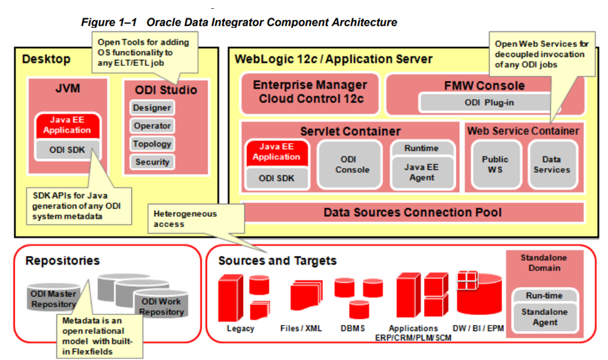
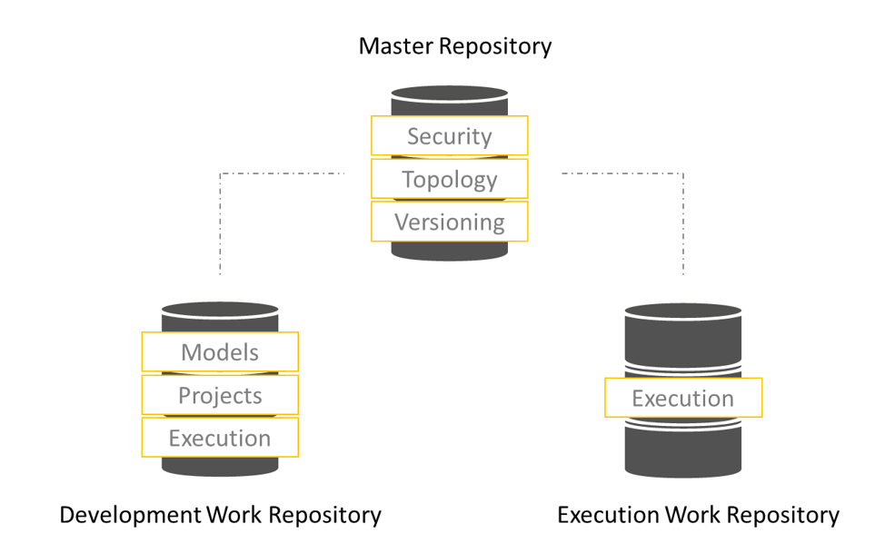
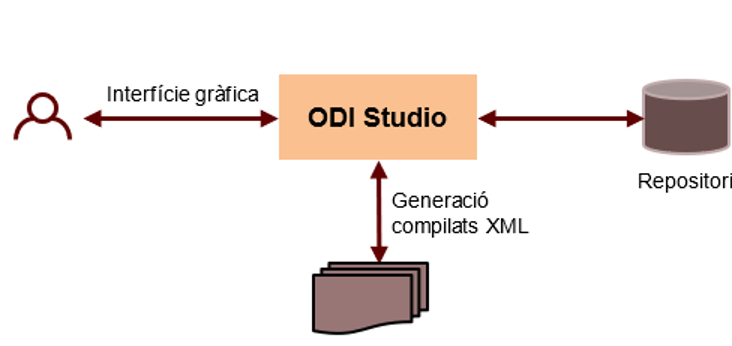

# ODI

## ¿Qué es Oracle Data Integrator (ODI)?
Es una plataforma de integración de datos que facilita la transferencia, transformación y carga de datos (ETL: Extract, Transform, Load) entre diferentes fuentes de datos. Está diseñada para manejar grandes volúmenes de datos y facilitar la integración en entornos de múltiples bases de datos, aplicaciones y sistemas.

### Características principales

- [x] **Integración de datos en tiempo real y batch**:
   ODI permite realizar integraciones tanto en tiempo real como por lotes (batch). Esta flexibilidad es clave en escenarios donde los datos deben procesarse en tiempo real para análisis inmediatos o cuando los procesos pueden esperar un procesamiento más programado.

- [x] **Transformación de datos**:
   ODI ofrece un motor de transformación de datos de alta performance, que permite realizar transformaciones complejas de los datos durante el proceso de integración. Esto incluye operaciones como agregaciones, uniones, filtrado y más.

- [x] **Conectividad con múltiples fuentes y destinos**:
   ODI soporta una amplia variedad de sistemas de bases de datos, aplicaciones y plataformas. Esto incluye Oracle Database, SQL Server, MySQL, y muchos otros sistemas tanto on-premise como en la nube. También puede integrarse con plataformas de Big Data como Hadoop, y soluciones en la nube como Oracle Cloud.

- [x] **Diseño gráfico y desarrollo fácil**:
   El desarrollo de procesos de integración en ODI es muy visual, con una interfaz gráfica de usuario (GUI) que permite diseñar flujos de datos sin necesidad de escribir código. Se utilizan objetos visuales como mappings, procedimientos y otros componentes que facilitan la construcción de los procesos de integración.

- [x] **Data Quality y validación**:
   ODI incluye capacidades de validación de datos, asegurando que los datos que se están integrando sean precisos, completos y estén en el formato adecuado. Esta es una característica importante en procesos de integración de datos en entornos empresariales donde la calidad de los datos es crítica.

- [x] **Automatización y gestión de procesos**:
   ODI permite la automatización de procesos de integración de datos mediante la planificación y ejecución de trabajos (jobs). También ofrece funcionalidades de monitoreo y auditoría para garantizar que los trabajos de integración se ejecuten de manera eficiente y sin errores.

- [x] **Integración con Oracle Ecosystem**:
   ODI se integra de manera nativa con el ecosistema de Oracle, lo que significa que se puede utilizar de forma eficiente con otras soluciones de Oracle como Oracle Exadata, Oracle Warehouse Builder y Oracle Business Intelligence.

### Arquitectura
**Arquitectura de repositorios**

ODI almacena todo su escosistema en metadatos en la base de datos. Se basa en repositorios llamados “Master repository” y “Work repository”. 

Existe un solo master repository compartido y como regla general un work repository por departamentos.

Los repositorios *Work Repository* existen de dos tipos: *Development* y *Execution*. En entornos productivos, será siempre del tipo "Execution" dado que sólo se despliega código compilado.

El *Master Repository* comparte con todos los Work Repository la : seguridad, conexiones (topología), versionado, etc…

Cada *Work Repository* tiene su código y no podrá ver el código de otro work pero si su seguridad y conexiones.

**Componentes del sistema**

-  **Consola ODI**: componente web que permite realizar el seguimiento de ejecución y parametrización de determinados objetos.

-  **Agente de ODI**: componente que s’encarga de ejecutar los procesos de carga i transformación de datos. Los agentes están ubicados en el weblogic.

-  **ODI Studio**: componente que proporciona la herramienta para el desarrollo y gestion. 

**Tipos de despliegues**

-  **Smart Export/Import**: despliegue que exporta todo objeto y lo más importante, sus dependencias. Cuando se realiza este tipo de despliegue, hay que tener especial cuidado con que objetos se lleva porque puedes machacar configuración de entornos Productivos como el agente, conexiones, etc..

-  **Export/Import**: exporta objetos de manera individual, con lo que te da el control total de que exportas e importas.

-  **Export Topology, Secutiry, Work Repository, etc**: hay muchos tipos más de exports/imports, pero en el día a día no se usarán. Son más para momentos puntuales a nivel administrativo / arquitectura. SIEMPRE se ha de desplegar código compilado, es decir “Scenarios”, “Load Plans”, Objetos de “Topology” e instrucciones para realizar programaciones en entornos Productivos.

### Usos comunes

- **ETL en proyectos de Data Warehousing**: ODI se utiliza ampliamente en la integración de grandes volúmenes de datos desde diversas fuentes hacia un Data Warehouse.
- **Migración de datos**: Es ideal para mover datos entre plataformas diferentes, ya sea para la actualización de sistemas o la migración a la nube.
- **Integración de Big Data**: Puede integrarse con tecnologías como Hadoop para procesar grandes volúmenes de datos no estructurados o semi-estructurados.
- **Integración de aplicaciones**: Permite la integración de diversas aplicaciones empresariales a través de la consolidación de datos.

**Oracle Data Integrator** es una herramienta potente para la integración de datos en empresas, diseñada para realizar ETL de manera eficiente, manejar grandes volúmenes de datos, y ofrecer flexibilidad tanto en procesamiento batch como en tiempo real.

## Descarga máquina virtual Oracle

**Descargar la máquina virtual** que contiene todo el entorno para hacer el desarrollo. 

[Pre-built Virtual Machine for Oracle Data Integrator 12c Getting Started Guide](https://www.oracle.com/middleware/technologies/data-integrator/odi-demo-downloads.html).

Contiene:

-   Oracle Enterprise Linux (64-bit) 2.6.32-300.39.5

-   Oracle EE Database 11.2.0.4

-   Oracle Data Integrator 12.2.1.3.1

-   Oracle GoldenGate 12.1.2.0.0

-   Java Platform (JDK) 1.8.0_60

## Overview

<video width="640"  controls>
    <source src="../../vid/ODI12c-Overview-JorgeSoro.mp4" type="video/mp4">
</video>

## Entorno
-   ODI Studio 12c
-   Mappings
-   Topologia logica y física
-   Contexto
-   Operador (agents)
-   Modelos
-   Planes de carga
-   Paquetes
-   Escenarios
-   Interpretación de logs
-   Load plans
-   Modulos de conocimiento:
    -   What is a Knowledge Module?
        -   Reverse-Engineering Knowledge Modules (RKM)
        -   Check Knowledge Modules (CKM)
        -   Loading Knowledge Modules (LKM)
        -   Integration Knowledge Modules (IKM)
        -   Journalizing Knowledge Modules (JKM)
        -   Service Knowledge Modules (SKM)